# mikerosoft.app

A bunch of personalised desktop tools, tracked in git so changes
are versioned and the setup can be reproduced on any machine.

---

## A note if you found this repo

These tools are built for one person on one machine - mine. They make assumptions
about paths, hardware, and workflows that are specific to my setup. They probably
won't work for you out of the box.

If you want to use any of this, the recommended approach is:

1. Clone it
2. Open it in Cursor (or your AI editor of choice) and **ask the agent to explain what each tool does and what it assumes**
3. Customise freely - change paths, remove tools you don't need, add your own
4. Don't open issues or pull requests. These aren't general-purpose tools and I'm not maintaining them for anyone but myself. Fork and adapt.

> Don't blindly trust what's here. Have your AI agent read the code and tell you what it will do before you run it.

---

## Tools

| Name | Type | Description |
|---|---|---|
| <br>[transcribe](tools/transcribe/README.md) | CLI + context menu | Extract audio from a video and transcribe it via faster-whisper (CUDA with CPU fallback); right-click any video file in Explorer |
| <br>[video-to-markdown](tools/video-to-markdown/README.md) | CLI + context menu | Convert a YouTube URL to a markdown image-link and copy it to clipboard; right-click any `.url` Internet Shortcut in Explorer |
| <br>[removebg](tools/removebg/README.md) | CLI + context menu | Remove the background from an image using rembg / birefnet-portrait; right-click any image file in Explorer |
| 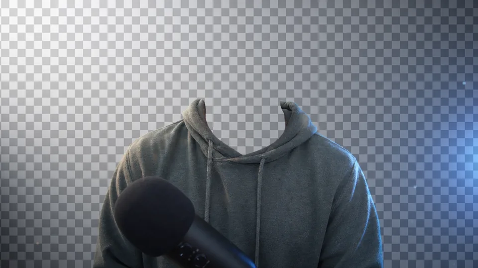<br>[remove-portrait](tools/remove-portrait/README.md) | CLI + context menu | Remove the background from a talking-head video and save a transparent MOV for Resolve; right-click any video file in Explorer |
| 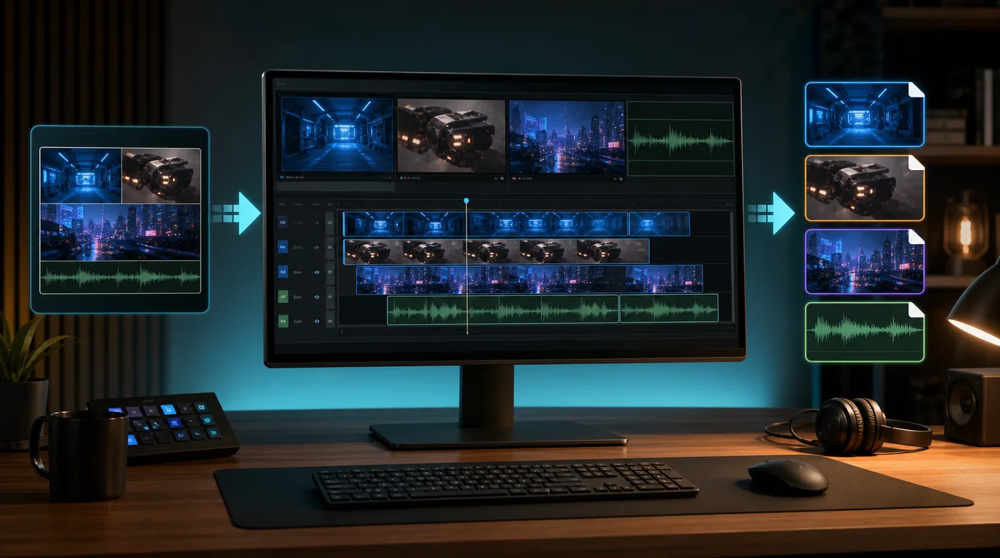<br>[unmultitrack](tools/unmultitrack/README.md) | CLI + context menu | Extract every video stream from an OBS/Aitum multi-track recording into separate editor-friendly files; right-click any video file in Explorer |
| <br>[img-upscale](tools/img-upscale/README.md) | CLI + context menu | Upscale an image locally with a quality-first transformer backend; right-click any image file in Explorer, choose `2x`, `4x`, `8x`, or `16x`, and keep the original file format |
| 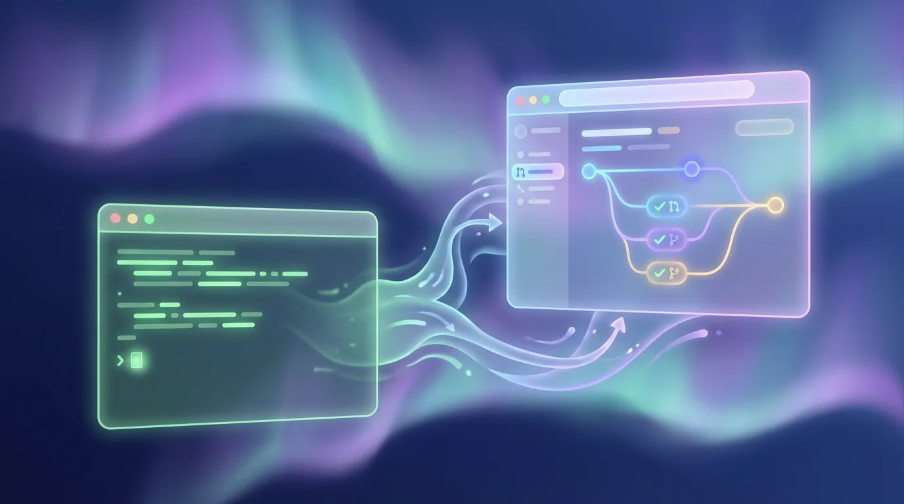<br>[ghopen](tools/ghopen/README.md) | CLI + context menu | Open the current repo on GitHub; opens the PR page if on a PR branch; right-click any folder in Explorer |
| <br>[ctxmenu](tools/ctxmenu/README.md) | GUI | Manage Explorer context menu entries - toggle shell verbs and COM handlers on/off without admin rights |
| 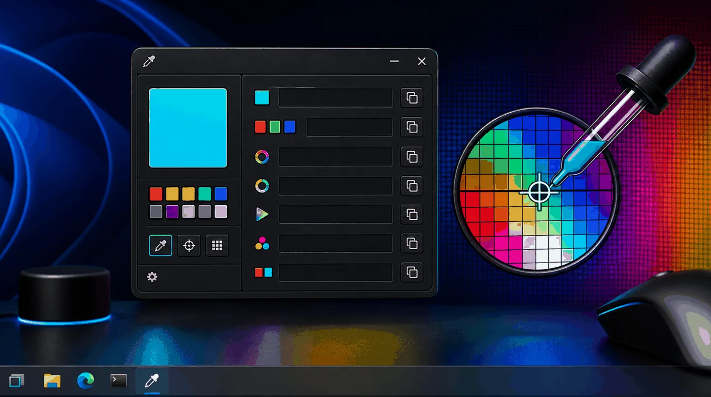<br>[color-picker](tools/color-picker/README.md) | GUI | Pixie-style screen color picker; drag over the screen, preview the live color, and copy HEX, RGB, HSL, HLS, HSV, CMYK, or BGR |
| <br>[backup-phone](tools/backup-phone/README.md) | CLI | Back up an iPhone over MTP (USB) to a flat folder on disk |
| 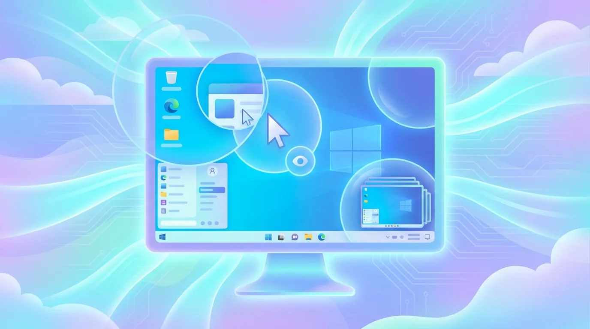<br>[scale-monitor](tools/scale-monitor/README.md) | Taskbar | Toggle Monitor 4 between 200% (normal) and 300% (filming) scaling |
| 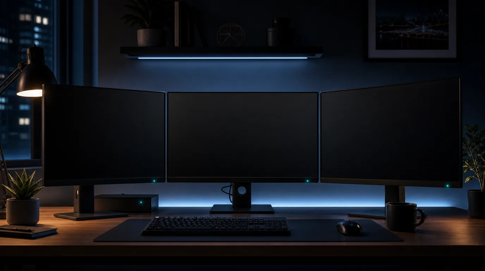<br>[sleep-monitors](tools/sleep-monitors/README.md) | CLI + shortcut | Turn off all connected monitors until keyboard or mouse input wakes them |
| <br>[task-stats](tools/task-stats/README.md) | Taskbar | Real-time NET/CPU/GPU/MEM sparklines overlaid on the taskbar |
| <br>[taskbar](tools/taskbar/README.md) | Mac - taskbar | Windows-style taskbar for macOS with one bar per monitor, pinned apps, battery/stats/date widgets, per-monitor overrides, and window avoidance |
| <br>[last-window-quits](tools/last-window-quits/README.md) | Mac - menu bar | Quit normal Dock apps when their final window closes, while preserving minimized windows and normal save prompts |
| <br>[record-it](tools/record-it/README.md) | Mac - GUI | Native SwiftUI screen and camera recorder with 4K/30 capture, project-aware output folders, and separate full-resolution files |
| 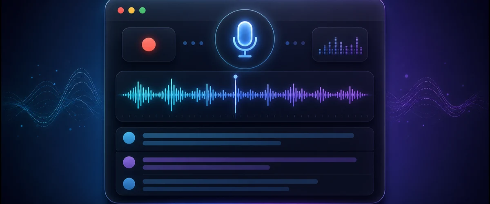<br>[record-meeting](tools/record-meeting/README.md) | Mac - GUI | Always-on-top meeting recorder with system audio + microphone capture, live waveform, synchronized transcript review, MP3 export, speaker-labelled transcription, and Notion publishing |
| 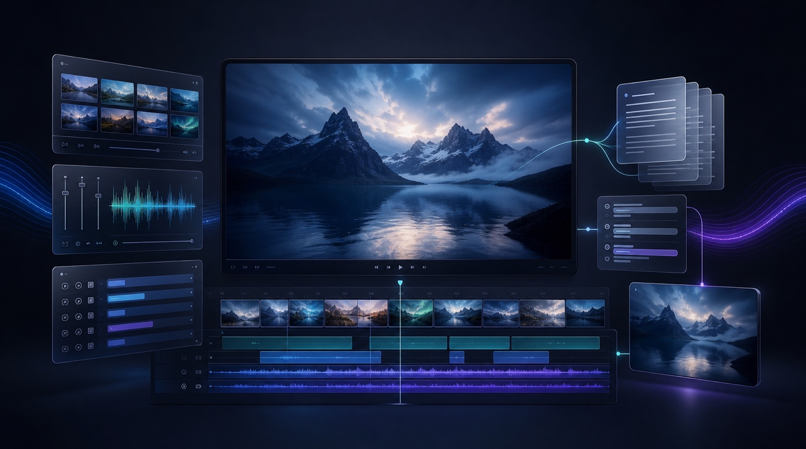<br>[video-hq](tools/video-hq/README.md) | Mac - GUI | Native video-production command center with project and render discovery, Notion script import, transcription, and YouTube descriptions |
| <br>[voice-type](tools/voice-type/README.md) | Taskbar + macOS daemon | Push-to-talk local voice transcription on Windows and macOS. On Apple Silicon it uses MLX for faster final transcription |
| <br>[video-titles](tools/video-titles/README.md) | Context menu | Chat with an AI agent to ideate YouTube titles using the Compelling Title Matrix; right-click any video in Explorer (requires `OPENROUTER_API_KEY` in `.env`) |
| <br>[video-description](tools/video-description/README.md) | CLI + context menu | Generate a YouTube description via Gemini; auto-loads or generates a transcript, then drops into an interactive chat for revisions; right-click any video in Explorer (requires `OPENROUTER_API_KEY` in `.env`) |
| <br>[generate-from-image](tools/generate-from-image/README.md) | Context menu | AI image generation from a reference image; right-click any image in Explorer, describe what you want, and Gemini generates a new image (requires `OPENROUTER_API_KEY` in `.env`) |
| <br>[svg-to-png](tools/svg-to-png/README.md) | Context menu | Render an SVG to PNG at high resolution; right-click any `.svg` file in Explorer; output is always at least 2048px on its smallest dimension |
| <br>[img-to-svg](tools/img-to-svg/README.md) | CLI + context menu | Convert a raster image to SVG vector using vtracer; right-click any image file in Explorer |
| <br>[copypath](tools/copypath/README.md) | CLI | Copy the absolute path of a file or folder to the clipboard; defaults to the current directory if no argument given |
| <br>[img-gen](tools/img-gen/) | GUI + context menu | Chat-style AI image generation using Gemini via OpenRouter; right-click any folder in Explorer; annotate generated images and refine iteratively; drag images out to Explorer to save (requires `OPENROUTER_API_KEY` in `.env`) |
| 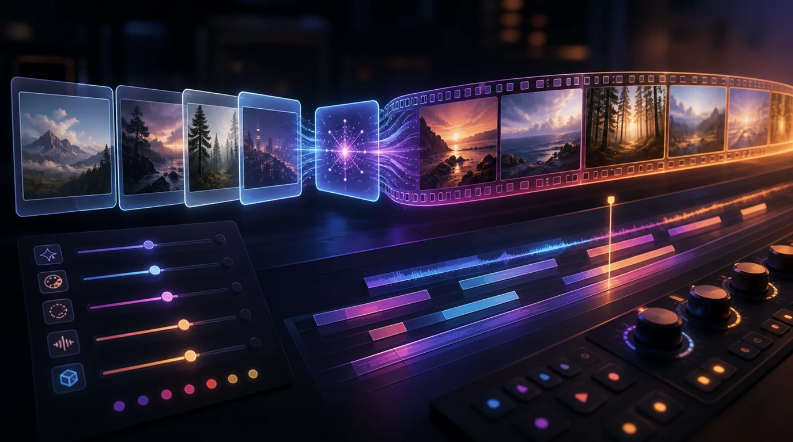<br>[video-gen](tools/video-gen/) | GUI + context menu | Chat-style AI video generation using OpenRouter video models; right-click any folder in Explorer; model-aware settings, reference images, first/last frames, save or drag generated MP4s into the folder (requires `OPENROUTER_API_KEY` in `.env`) |
| 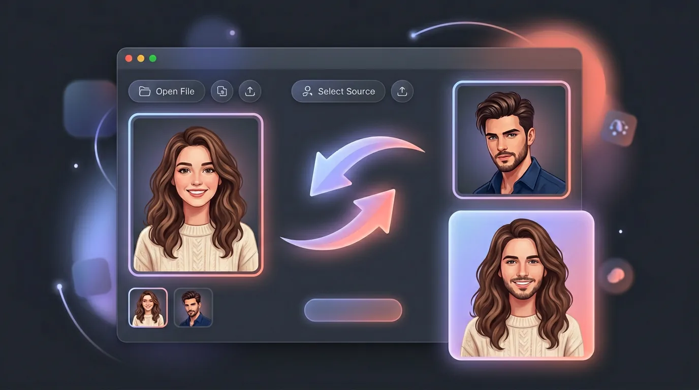<br>[face-swap](tools/face-swap/README.md) | GUI + context menu | Swap a face from one image into another locally using InsightFace; right-click any image to pre-load the target, or launch it from Windows Search |
| 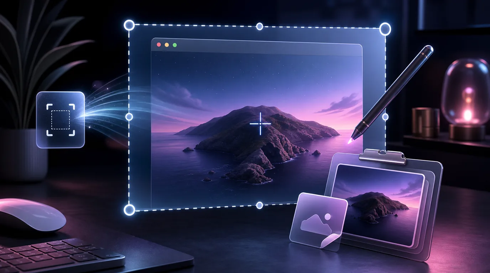<br>[mac-screenshot](tools/mac-screenshot/README.md) | Mac - global hotkey daemon | Press `F11` to capture a screen region, auto-name it, copy it to the clipboard, and open it in Preview for annotation |
| <br>[worktrees](tools/worktrees/README.md) | CLI (Bun) | Interactive `git worktree` cleanup: list linked checkouts, remove a subset, or remove all linked worktrees (macOS + Windows) |

---

## Quick start (fresh Windows machine)

```powershell
git clone <repo-url> C:\dev\me\mikerosoft.app
cd C:\dev\me\mikerosoft.app
copy .env.example .env        # then edit .env and fill in your API keys
powershell -ExecutionPolicy Bypass -File install.ps1
```

`install.ps1` loads `.env`, checks whether `C:\dev\tools` is on your `PATH`
and offers to add it automatically if not. It will error out if any required
API keys are missing.

---

## macOS setup

The root install flow is still **Windows-specific**. It creates `C:\dev\tools`
stubs, Explorer context menu entries, `.lnk` shortcuts, and other Windows-only
integration points.

For macOS, set tools up individually where mac support exists:

- `voice-type`:
  `bash tools/voice-type/setup_mac.sh`
- `mac-screenshot`:
  `bash tools/mac-screenshot/setup_mac.sh`
- `ghopen`:
  `bash tools/ghopen/setup_mac.sh`
- `worktrees` (needs [Bun](https://bun.sh) on your PATH): see [tools/worktrees/README.md](tools/worktrees/README.md) for setup (`install-to-path.sh` plus `~/.local/bin` on `PATH`).
- `taskbar`:
  `bash tools/taskbar/setup_mac.sh`
- `last-window-quits`:
  `bash tools/last-window-quits/setup_mac.sh`
- `record-it`:
  `bash tools/record-it/setup_mac.sh`
- `record-meeting`:
  `bash tools/record-meeting/setup_mac.sh`
- `video-hq`:
  `bash tools/video-hq/setup_mac.sh`

At the moment that is the right shape for the repo. A fake "universal" root
installer would mostly be a wrapper around platform checks and per-tool scripts,
while still not covering the Windows-only integrations.

### macOS support matrix

| Tool | Status | Setup | Daily command | Notes |
| --- | --- | --- | --- | --- |
| `voice-type` | Supported | `bash tools/voice-type/setup_mac.sh` | `bash tools/voice-type/voice-type-mac.sh` | Push-to-talk voice typing on macOS. On Apple Silicon it prefers `MLX Whisper` for supported final models. Settings can be opened with `bash tools/voice-type/open-settings-mac.sh` or via Spotlight `Voice Type` |
| `mac-screenshot` | Supported | `bash tools/mac-screenshot/setup_mac.sh` | `bash tools/mac-screenshot/restart.sh` | Global screenshot hotkey daemon for macOS. Optional login-item install via `bash tools/mac-screenshot/install-launchagent.sh` |
| `ghopen` | Supported | `bash tools/ghopen/setup_mac.sh` | `ghopen` | Opens the current repo on GitHub. With `gh` installed it opens the PR page first when the branch has one |
| `worktrees` | Supported | See [tools/worktrees/README.md](tools/worktrees/README.md) | `worktrees` | Needs `~/.local/bin` on `PATH` (or run `bash tools/worktrees/run.sh`). Uses the checkout you are in to find `tools/worktrees`; run `bun install` in that folder per clone if deps are missing |
| `taskbar` | Supported | `bash tools/taskbar/setup_mac.sh` | `taskbar restart` | Swift/AppKit taskbar for macOS. Run `bash install_mac.sh` if you want the `taskbar` launcher on `PATH` |
| `last-window-quits` | Supported | `bash tools/last-window-quits/setup_mac.sh` | `last-window-quits restart` | Menu-bar daemon that quits regular Dock apps after their final window closes. Requires Accessibility permission |
| `record-it` | Supported | `bash tools/record-it/setup_mac.sh` | `record-it` | SwiftUI + ScreenCaptureKit + AVFoundation recorder. Saves into the selected project's `source` folder |
| `record-meeting` | Supported | `bash tools/record-meeting/setup_mac.sh` | `record-meeting` | SwiftUI meeting audio recorder with diarized transcripts and optional Notion publishing |
| `video-hq` | Supported | `bash tools/video-hq/setup_mac.sh` | Launch `Video HQ` from Spotlight or run `video-hq` | Project-first command center with Notion script import, rendered-video preview, transcription, and OpenRouter-powered descriptions |
| Everything else | Windows-only for now | Use `install.ps1` on Windows | Varies by tool | Most other tools still depend on Windows-specific shell integration, taskbar shortcuts, or Explorer context menus |

### Codex worktrees

The checked-in local environment at `.codex/environments/environment.toml`
bootstraps new Codex worktrees without changing global PATH entries, registering
daemons, or installing heavyweight per-tool runtime dependencies. It installs
the Bun packages under `tools/` and the website's npm dependencies.

Select the `mikerosoft` local environment once in Codex project settings. Codex
will then run `.codex/setup.sh` whenever it creates a worktree. Run the same
script manually to refresh dependencies in an existing worktree:

```bash
bash .codex/setup.sh
```

---

## How it works

```
C:\dev\me\mikerosoft.app\   <- this repo (source of truth)
    install.ps1
    tools\
        transcribe\
            transcribe.bat            <- real logic lives here
        scale-monitor\
            scale-monitor.ps1
            scale-monitor.vbs
            scale-monitor.bat
        ...

C:\dev\tools\                    <- on PATH; kept clean
    transcribe.bat               <- thin stub: sets EXEDIR, calls repo bat
    removebg.bat                 <- thin stub
    backup-phone.bat             <- thin stub
    Scale Monitor.lnk           <- taskbar shortcut -> repo .vbs
    ffmpeg.exe                   <- large binaries stay here, not in repo
    faster-whisper-xxl.exe
    ...
```

`install.ps1` generates the stubs. Each CLI gets a `.bat` for PowerShell/cmd
and an extensionless Git Bash shim that forwards to the `.bat`, so `ghopen`
works from Git Bash instead of needing `ghopen.bat`. The stubs point at
absolute paths inside the repo, so a `git pull` is all you ever need to pick up
changes to any tool. Re-run `install.ps1` only when **adding a new tool**.

---

## Updating a tool

```powershell
# 1. Edit the source file in the repo (e.g. tools\scale-monitor\scale-monitor.ps1)
# 2. Run the relevant automated tests
# 3. Smoke-test the real tool entry point if behaviour changed
# 4. Commit
cd C:\dev\me\mikerosoft.app
git add .
git commit -m "scale-monitor: describe the change"
```

No reinstall needed. The stub in `C:\dev\tools` already points at the repo file.

For `task-stats`, there is now a proper automated stack under [`tools/task-stats/tests/README.md`](tools/task-stats/tests/README.md), including unit tests, Windows integration tests, and opt-in screenshot + AI evaluation.

---

## Adding a new tool

### CLI tool (runs from terminal)

1. Create a subfolder: `mkdir my-tool`
2. Write the logic - a `.bat`, `.ps1`, or `.vbs` as appropriate
3. Add a stub entry in `install.ps1` using the `Write-BatStub` helper
4. Run `install.ps1` once
5. Commit everything

Stub pattern for a plain bat tool:

```powershell
Write-BatStub "my-tool" @"
@echo off
call "$RepoDir\tools\my-tool\my-tool.bat" %*
"@
```

Stub pattern when the tool needs the `C:\dev\tools` exe directory (like `transcribe`):

```powershell
Write-BatStub "my-tool" @"
@echo off
set "EXEDIR=%~dp0"
call "$RepoDir\tools\my-tool\my-tool.bat" %*
"@
```

Then in `my-tool.bat` use `%EXEDIR%` instead of `%~dp0` to find co-located binaries.

### Taskbar / GUI tool (like scale-monitor)

1. Create a subfolder with the `.ps1` and a `.vbs` launcher:

   **`my-tool.vbs`** (boilerplate - copy from `tools\scale-monitor\scale-monitor.vbs`):
   ```vbs
   Set objShell = CreateObject("WScript.Shell")
   objShell.Run "powershell.exe -NoProfile -WindowStyle Hidden -ExecutionPolicy Bypass -File """ & _
       CreateObject("Scripting.FileSystemObject").GetParentFolderName(WScript.ScriptFullName) & _
       "\my-tool.ps1""", 0, False
   ```

2. Add a shortcut entry in `install.ps1`:

   ```powershell
   $vbsPath      = "$RepoDir\tools\my-tool\my-tool.vbs"
   $shortcutPath = Join-Path $ToolsDir "My Tool.lnk"
   $wsh = New-Object -ComObject WScript.Shell
   $sc  = $wsh.CreateShortcut($shortcutPath)
   $sc.TargetPath       = "wscript.exe"
   $sc.Arguments        = "`"$vbsPath`""
   $sc.WorkingDirectory = "$RepoDir\tools\my-tool"
   $sc.Description      = "What this tool does"
   $sc.IconLocation     = "%SystemRoot%\System32\imageres.dll,109"
   $sc.Save()
   ```

3. Run `install.ps1`, then right-click the `.lnk` in `C:\dev\tools` -> **Pin to taskbar**.

---

## Notes

- Large binaries (`ffmpeg.exe`, `faster-whisper-xxl.exe`, `_models\`, etc.) live in
  `C:\dev\tools` and are **not** tracked here - too big for git.
- The `transcribe` stub injects `EXEDIR=C:\dev\tools` so the bat finds those binaries
  even though the logic now lives in this repo.
- If you move the repo, just run `install.ps1` again to regenerate the stubs with
  the new absolute path.
- `install.ps1` registers a "Mike's Tools" submenu in the Explorer right-click
  context menu for: common video extensions (transcribe), common image extensions
  (removebg), and folders / folder backgrounds (ghopen). All entries write to
  `HKCU\Software\Classes\...` and are safe to re-run - idempotent.
