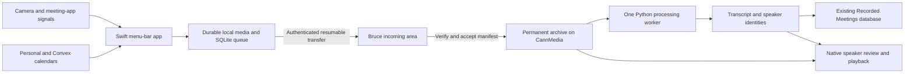

# Meeting Archive: implementation plan

Status: implementation in progress on `codex/meeting-archive`, 2026-09-17. The signed Mac app passed a 149-second Zoom capture through camera-off, default-save, verified Bruce archival, real Whisper/pyannote processing, hardware H.264 playback, and Notion publication. The Mac login item is enabled and running as one managed instance. After Michael granted drive access, Bruce's signed launcher passed managed startup, clean shutdown, and KeepAlive restart. Michael's later 30-second solo test reached the managed worker and completed processing/publication after correcting excessive disk throttling and retrying its existing job. A fresh run without corrective intervention and an actual reboot remain untested. Private playback activation, both Google calendar accounts, notifications, wider meeting-app coverage, and broader user acceptance remain incomplete.

Michael confirmed filming is finished and authorized copying the existing transcription and Notion credentials to Bruce. Local validation has resumed with brief checks while he edits; Record It and system device settings remain untouched. See [the validation report](meeting-archive-validation.md) for evidence and remaining gates. A checked requirement below means agreed scope, not completed implementation.

Fable review recommendations adopted: explicit meeting-surface identity tests (including previews/pre-join), Chrome tab changes and window minimization as first-milestone requirements, timestamp conversion/drift and overlapping-speech tests, backup coverage verification before enabling cleanup, permission-loss and local-spool tests, and one complete vertical workflow before broad integration. Remembered speakers and immediate deliberate camera-off remain required. Do not assume a tab-capture extension can start without user interaction. See `meeting-archive-fable-review.md` for the unchanged review evidence.

This plan supersedes the earlier suggestions to record a separate 720p camera feed, leave ignored recordings pending, require speaker naming before processing, run transcription on the desktop by default, and delete media after a retention period.

## 1. What we are building

A macOS background tool that records meetings automatically when a supported meeting application uses the camera. It records the meeting window, including participants and shared content displayed there, the current system-default microphone, and incoming meeting/system audio. When that meeting application's camera switches off, the recording ends. The recording is kept automatically, processed on Bruce, and indexed in Notion. Text is the main reference; video remains available permanently.

Working name: **Meeting Archive**, under `tools/meeting-archive`. Use a Swift/SwiftUI macOS application and a Python worker on Bruce. These names and implementation details are proposals, not requirements from Michael.

### Confirmed requirements

- [x] macOS only for this version.
- [x] Start automatically after login following a restart and recover from process crashes.
- [x] Start on camera use by a supported meeting application; stop when its camera turns off.
- [x] Cover Google Meet in Chrome, Zoom, Teams, and Slack.
- [x] Exclude Record It and camera-preview applications.
- [x] Record the meeting window, including other participants and shared screens as displayed by the meeting application, plus default system microphone and incoming meeting/system audio. Capture follows the meeting view, not the entire desktop.
- [x] Use 1080p as the starting video profile with a modest frame rate, subject to shared-text readability and resource measurements. Preserve speech quality.
- [x] Use the camera only as the start/stop indicator. Do not create a separate recording of the local camera; Michael's self-view appears only if the meeting window displays it.
- [x] Continue recording the system-default microphone when Michael mutes himself in the meeting application.
- [x] Store dates, start/end times, timezone, and duration.
- [x] Offer an editable calendar-based title from both personal and Convex calendars.
- [x] Closing or ignoring the end prompt must still save, transcribe, and archive.
- [x] Prefer Bruce for transcription, speaker processing, and any later video conversion.
- [x] Reuse named speakers automatically when the match is reliable; offer identification of unfamiliar voices.
- [x] Use attendees from the matched calendar event to suggest speaker names, while keeping invitation evidence separate from voice identification.
- [x] Retain all accepted meetings and their media permanently on Bruce.
- [x] Delete local recording copies after all source media and required metadata have been verified in the permanent Bruce archive. Retain the lightweight local index and transcript cache.
- [x] Provide Skip this meeting in the menu bar, suppressing capture for the rest of that camera session.
- [x] Notify when recording actually starts and when it finishes. Do not notify on successful transcription or Notion publication.
- [x] Produce a detailed task checklist, then build with Sol and smaller sub-agents, perform end-to-end validation, and finish with Michael's fake-meeting smoke test.

### Proposed implementation defaults

- Record the meeting view within a 1920 x 1080 output canvas at up to 15 fps using hardware HEVC, initially targeting about 2 Mbit/s. Preserve aspect ratio without cropping shared content; avoid enlarging a small source and pretending it contains 1080p detail. Use hardware H.264 if HEVC is unavailable or playback compatibility requires it. Measure actual shared-text readability, motion, file size, and performance before fixing these defaults.
- Save microphone and incoming audio separately with synchronized timestamps. Provisional AAC settings: 48 kHz, 96 kbit/s mono microphone and 128 kbit/s stereo incoming audio. Keep the originals; make a mixed playback track on Bruce.
- Show the naming prompt immediately after capture. Accept automatically after 20 seconds, or immediately on closing it. Persist the default-save decision and deadline so an app crash cannot strand it. Editing afterward remains possible.
- No long camera-off grace period. After the first confirmed off event, stop accepting media; a later camera-on creates a new recording. UI notification latency is separate from the actual capture cutoff.
- No automatic archive expiry, rolling media purge, or deletion of source recordings after transcoding.
- Remove local recording copies only after the remote verification and durable processing handoff described below. Bruce's accepted archive has no automatic deletion workflow. An explicit Discard before acceptance cancels that recording.
- No Windows build, automatic task creation, AI meeting summaries, or recording of audio-only calls in version one.
- No Convex backend is needed for this design. Any later Convex schema proposal remains subject to manual approval.

## 2. What has been checked

Read-only discovery during this planning session found:

| Area | Verified evidence | Consequence |
| --- | --- | --- |
| Existing recorder | `tools/record-meeting` captures microphone and system audio, runs faster-whisper and pyannote, and writes MP3, transcript JSON/Markdown, and metadata | Reuse tested concepts and processor seams; do not rebuild every component |
| Existing files | Installed Record Meeting app and `~/RecordedMeetings` directory are present | Add an import path without moving or deleting old recordings |
| Notion | Record Meeting preferences have a configured data-source ID and automatic publishing enabled; the connector can read the existing Recorded Meetings schema | Prefer extending that database compatibly, not creating a duplicate |
| Current desktop | macOS 26.6.2 | Validate on the installed system and actual camera; do not assume old SDK behaviour |
| Bruce | Reachable over existing authenticated SSH; M1 Mac mini, 8 GB RAM, eight logical CPUs, macOS 26.5 | Use one heavy processing job at a time and benchmark before selecting a model |
| Bruce storage | CannMedia has about 4.1 TiB free; internal startup volume has only about 18 GiB free | Put media, model downloads, extraction scratch, and processing output on CannMedia |
| Bruce utilities | ffmpeg 8.1, rsync 3.4.4, Python 3.13 and 3.14 installations are present | Prefer a pinned dedicated environment after checking wheel compatibility; do not assume the newest Python works with every model package |
| Existing Bruce services | LaunchAgents for other tools and backups are present | Use a separate worker and bounded resource usage |
| Calendar connector | Calendar listing failed with insufficient OAuth scope | Account visibility is not verified; do not assume a running app can reuse Codex connector credentials |
| Build tools | Apple developer-tool invocation reported an unaccepted Xcode license | Resolve through the normal user-controlled developer setup before any build; no tests were run for this plan |

These are planning snapshots, not guarantees of future free space or service health. During implementation, the Backblaze configuration was checked and includes CannMedia without excluding the Meeting Archive directory or its media types. A restore remains unverified; local cleanup stays disabled during validation.

## 3. Feasibility gates before the full build

### Gate A: camera attribution and stop detection

Apple documents `AVCaptureDevice.isInUseByAnotherApplication`, and CoreMediaIO exposes a running-somewhere flag. Neither document alone establishes that all relevant drivers expose every consuming app or that a meeting's camera-off button releases the device. The revised recorder observes the camera without opening its own camera capture session, removing the previous design's risk of keeping the camera active itself.

Test the actual camera and applications. The observer must never activate the camera, hold it open, or reconfigure it. A recording cannot be classified as a meeting just because Chrome, Zoom, or Record It happens to be open.

- [x] A01. Build a diagnostic observer with timestamped device transitions and no recording. Its fixture tests passed; real application attribution still requires A02-A08.
- [ ] A02. Record the API behaviour for Meet, Zoom, Teams, Slack, Record It, a native preview app, and a Chrome camera-preview page.
- [ ] A03. Repeat with an independent camera client active. Check that only the meeting application's camera state controls the recording and that our passive observer never keeps the camera open.
- [ ] A04. Test camera toggles, call exit, app quit/crash, background windows, multiple Chrome tabs, and multiple meeting apps.
- [ ] A05. Test concurrent preview activity: closing the meeting while a preview remains open must still stop the meeting recording.
- [ ] A06. Test apps that send black video or disable a WebRTC track while retaining the camera device. Map the meeting's off control to a real stop signal; physical-device activity is not an adequate substitute.
- [ ] A07. Evaluate a narrow Chrome meeting-domain extension and native app adapters only if public device signals cannot meet attribution requirements. A browser adapter would report local outgoing-camera state, never remote participants' camera state. Record any added permissions and maintenance costs.
- [ ] A08. Produce a supported-app matrix with observed evidence, detection delay, exclusions, and failures. A guessed owner or a stale app signal is not a pass.

If a supported application cannot be detected reliably, show the exact limitation and settle the fallback with Michael before claiming complete automatic support. Do not silently broaden capture to every camera user, rely on private log scraping as the sole production signal, or switch to recording all system audio continuously.

### Gate B: meeting-window capture and meeting quality

- [ ] B01. Identify and capture the actual meeting window for each supported application, including participants, slides, code, and other shared content. Prove that a meeting app being open is insufficient to select an unrelated window.
- [ ] B02. Encode the meeting view at the proposed 1080p profile without opening a camera session or changing the meeting app's device configuration. Check small shared text, resizing, aspect ratio, and screen-share transitions.
- [ ] B03. Measure CPU, memory, dropped frames, encoder backpressure, and audio continuity during a real call. Drop our video frames before allowing video backpressure to damage speech capture.
- [ ] B04. Verify default microphone capture and incoming audio with headphones, speakers, muted microphone, and a microphone change.
- [ ] B05. Prove app-scoped incoming audio where available. A Chrome application filter may include audio from other Chrome tabs; test that explicitly. If finer isolation is unavailable, describe the scope and agree on it rather than claiming meeting-only audio.
- [ ] B06. Test window occlusion, minimization, different Spaces/displays, fullscreen, pop-out shared content, and window replacement. Do not silently freeze a frame or switch to recording the entire display when the source disappears.
- [ ] B07. Test Meet when the user changes Chrome tabs or detaches the meeting tab. Window capture is not automatically tab capture. Prove that capture stays with the meeting, or visibly marks the video unavailable rather than recording unrelated browsing. Evaluate a meeting-tab adapter if needed.
- [ ] B08. Test screen-share pop-outs and participant windows together. Prefer shared content as the main view while it is active and retain displayed participant tiles where the app makes them available; if a composite is needed, capture only positively identified meeting surfaces. Record source changes in metadata.

If a meeting surface cannot be identified or captured reliably, keep recoverable audio and report incomplete video, then decide the product fallback. Do not present audio-only capture or an unrelated app window as fulfilment of the video requirement. The archive contains the meeting view available to this computer, not independent feeds for participants hidden by the application's layout.

### Gate C: Bruce processing and private playback

- [ ] C01. Benchmark representative multi-speaker audio on Bruce using a compatible pinned environment.
- [ ] C02. Compare the existing CPU/int8 Whisper path against a suitable Apple Silicon implementation only if runtime or accuracy justifies it. No requirement to use a large model simply because it exists.
- [ ] C03. Check diarization and speaker embedding memory use separately; release model memory between stages if needed.
- [ ] C04. Prove that a Notion entry can open its recording privately in the installed app, including seeking to transcript timestamps.

Do not promise a browser-playable public URL for private media. The proposed first option is an app deep link carrying only the stable meeting ID, with authenticated SSH retrieval. Test that Notion accepts and opens the link. If it does not, agree on a private HTTPS playback route or use the native searchable library as the explicit interim route.

## 4. Architecture and boundaries



### Desktop application

Use SwiftUI/AppKit for the menu bar, settings, naming prompt, recording history, and speaker review. Use AVFoundation/CoreMediaIO for passive camera observation, Core Audio for system-default input changes, and ScreenCaptureKit for meeting-window video and incoming audio where supported. Isolate those APIs behind testable adapters. Do not open an AVCaptureSession for a separate webcam feed.

Resolve the meeting's window identity from the proven app adapter and keep it separate from camera ownership. Follow positively identified window replacements and share pop-outs, not whichever window is currently foreground. ScreenCaptureKit has a single-window filter, but browser-tab identity and multiple meeting windows require additional handling. If selection is ambiguous, show a nonblocking source chooser and mark the video gap; do not choose an arbitrary window. Test an automatic path for ordinary meetings so this remains a background tool.

Register a per-user background service with the supported macOS service-management APIs. It runs after login, under the signed app's identity and granted privacy permissions. It does not attempt camera capture at the FileVault login screen. Validate crash restart and an explicit Pause state that survives restart. Avoid a supervisor that immediately relaunches after the user intentionally chooses Quit/Disable.

The first-run setup presents the actual permissions needed for selected integrations. The menu icon clearly shows armed, recording, paused, or error. Capture is event-driven; no continuous audio prebuffer is proposed. Record start latency honestly because a post-trigger recorder cannot recover speech from before it started.

Provide **Skip this meeting** in the menu bar while a meeting camera session is active. Stop any current capture and persist suppression tied to that session; repeated camera-on/app signals or an app restart must not immediately restart recording. Clear the suppression on a confirmed end of that camera session. Keep any already-recorded portion through the normal auto-save flow unless Michael explicitly chooses Discard. Global Pause remains a separate persistent control.

Send a brief **Recording started** notification only after capture has actually begun, with a degraded/error state if a required source fails. At normal stop and successful finalization, send **Recording finished** with duration and accurate processing status, such as queued for Bruce. Coalesce this with the naming prompt so it does not produce duplicate alerts. A skip or failure uses accurate stopped/skipped/failed wording. Do not claim the recording is archived before remote verification. No routine notification when transcription finishes or Notion publication succeeds; show those states and unknown-speaker review badges in the app. Actionable capture/storage failures can still notify. Notification denial or Focus suppression must not block capture; keep menu-bar state accurate.

### Capture and local journal

Proposed root: `~/Library/Application Support/Meeting Archive/`. Keep SQLite on the local disk, never on an SMB share. Put in-progress recordings under a durable spool, not an OS-purgeable temporary directory.

Use a common monotonic timeline and a durable manifest. The implementation currently uses fragmented MOV/M4A containers with two-second fragments instead of separate segment files. The forced-process-exit experiment recovered four seconds from a six-second input with about 137 ms maximum track-end difference. That supports recovery of completed fragments with loss of the active tail; it does not prove power-loss durability. Preserve recovered original files and make a stable playback remux on Bruce.

Keep meeting-window video, microphone audio, and incoming audio independently recoverable. No fabricated catch-up video frames. A static slide with sparse screen frames is healthy; distinguish that from an unavailable window using capture status and source events, not a video inactivity timeout alone. Preserve the actual sample timeline and gaps. Record wall-clock UTC timestamps, captured timezone, monotonic duration, start/end trigger time, first/last sample time, and actual captured duration separately. Include window/source identity and changes, with enough context to explain a video gap without collecting unrelated window titles.

Resolve the system-default microphone through the audio-device API, not a hard-coded Yeti name. Follow a default-input change with a recorded segment boundary and gap if required. Recording deliberately continues when Michael mutes himself inside the meeting application. Do not gate microphone samples on meeting mute state. A physical microphone mute or OS/device unavailability may still prevent usable audio; distinguish those cases from application mute and ordinary silence in validation.

### Save prompt and jobs

At camera-off, finalize the capture and create an automatic acceptance deadline. Show the suggested title, description, duration, Keep, and Discard. Closing the prompt accepts immediately. Ignoring it accepts at the deadline. After restart, overdue unhandled prompts default to acceptance.

Until that short deadline or explicit acceptance, keep data local so Discard is unambiguous. Once accepted, start transfers and processing without waiting for speaker review. The visible text should say that the meeting saves automatically. Title edits use the meeting ID, so they do not rename directories during a transfer.

Persist capture state and separate job state. Capture can start a new session while another recording transfers, processes, awaits speaker review, or retries Notion publication.

### Transfer and permanent archive

Use the existing verified SSH route to Bruce. Transfer into a meeting-ID staging directory using a resumable protocol without delete/mirror flags. Hash finalized files locally, re-hash on Bruce, compare size and SHA-256, and acknowledge an immutable manifest version before marking the media archived.

Proposed archive root: `/Volumes/CannMedia/MeetingArchive/`. Verify volume identity and mount state before creating paths or writing; an absent disk must not cause writes into a lookalike folder on the startup volume. Keep model cache and extraction scratch on the external volume too. Pin the expected volume during installation, not by copying today's device node number.

On Bruce, a worker claims only complete verified manifests using a durable job store and recoverable leases. A worker restart resumes or retries a stage instead of duplicating work. Versions prevent an old processing result from overwriting later title or speaker corrections.

Example bundle layout:

```text
MeetingArchive/YYYY/MM/<meeting-id>/
  manifest.json
  metadata.json
  media/meeting-view-0001.mov
  media/microphone-0001.m4a
  media/incoming-0001.m4a
  playback/meeting.mp4
  transcripts/v1/transcript.json
  transcripts/v1/transcript.md
  transcripts/v1/transcript.vtt
  speakers/assignments.json
  processing/history.jsonl
```

Original media remains after generating playback files. Reprocessing writes a new transcript version. Operational logs can rotate; meeting media, metadata history, and transcript versions do not expire. Never interpret network transfer success alone as verified archival.

After Bruce acknowledges the complete manifest in its permanent archive and durably queues processing, remove the corresponding local media copies. Require verification of every source file and the captured metadata, not just one successful upload or a Notion link. Persist that acknowledgement and make cleanup restart-safe and restricted to explicit manifest paths within the app-owned spool. Do not follow symlinks, delete a current recording, or let an older acknowledgement delete a newer/untransferred file. Retain local IDs, archive paths, hashes, status, and transcript/search metadata for discovery; re-fetch playback media when needed and evict only verified playback-cache duplicates. No waiting for transcription completion is necessary because Bruce already holds its complete inputs. Remote verification or handoff failure leaves the local source intact. This is local-copy cleanup, never deletion of the permanent Bruce media.

### Bruce worker

Run a dedicated versioned Python environment with pinned packages and downloaded models. Reuse processor logic from Record Meeting behind a noninteractive CLI contract. Unattended jobs must not depend on a Codex session, Codex connector, interactive Keychain prompt, or desktop UI.

Only one heavy job runs at a time on the 8 GB M1. Transcription/diarization and any video conversion run sequentially. Archive transfer can proceed separately with conservative concurrency. Retry transient errors with backoff; keep permanent failures visible and recoverable. While Bruce is offline, the desktop queues work without silently starting expensive local inference. Offer explicit local processing as a later fallback.

The transcript comes from the preserved audio tracks. There is no separate second transcription of the video file. Any requested video transcode/mux is a separate job on Bruce and leaves the recorded source intact.

### Speaker identification

Diarization assigns within-meeting speaker labels; cross-meeting identity needs a separate voice-profile layer. Existing names are useful labels, not precomputed voiceprints.

Build voice profiles only from user-confirmed, sufficiently clean speech. Match multiple usable samples, require both an adequate score and separation from the next-best candidate, and leave weak/overlapping/very short speech unknown. Calibrate on known and deliberately unseen speakers; do not treat a cosine score as a calibrated probability.

High-confidence matches automatically fill the name as requested. Unknown speakers appear in a review inbox with several short playable excerpts, transcript context, and options to select an existing person, create a person, split an incorrectly merged speaker, or leave it unknown. A local microphone track is not automatic proof that Michael is the sole person speaking.

Use the confidently matched calendar event's attendee names/emails as a candidate shortlist. Link to existing people through confirmed account/email associations; do not merge people solely by matching names. Prefer relevant attendees in the chooser and display a reason such as **Invited to this meeting** separately from **Voice matched a previous recording**. When an attendee has a confirmed voice profile, compare it to the observed voice; keep strong non-attendee matches and Unknown available because guests can be absent, uninvited people can join, and invitations can hide attendees. Calendar membership alone must never auto-assign a voice, lower the minimum voice-match threshold, force the number of detected speakers, or infer the last unknown person by elimination. For a new voice, let Michael play a sample and choose from the shortlist; that explicit confirmation can enroll the person for future meetings. If the event match is uncertain or attendee access is unavailable, fall back to ordinary speaker review without guesses.

Keep voice profiles and matching evidence on Bruce, with the minimum local cache required for review. Store profile/model versions, confirmation provenance, and correction history. Do not feed unconfirmed automatic matches back into the profile library. A correction updates the native transcript and the same Notion entry without rerunning speech-to-text.

### Calendars

Use a provider interface. First check whether both accounts are available through macOS Calendar/EventKit. If they are, use selected calendars after normal user permission. EventKit requires its full-access permission to read events even though our code only reads them.

If either account is unavailable there, support desktop Google OAuth for both accounts with the necessary read-only calendar scopes and tokens in Keychain. Google Workspace policy may require account-side approval. Do not borrow Codex's session tokens.

Fetch a bounded time window, cache candidates, and rank by time overlap and meeting-link match when available. Exclude cancelled, declined, and irrelevant all-day events; handle recurring exceptions, duplicates across calendars, daylight-saving changes, and overlapping events. Preserve the candidate source and confidence. Only use an unambiguous best match as the editable default; otherwise fall back to `Meeting - date/time`. Calendar failure never blocks capture or saving.

For the matched event, snapshot attendee names/emails when available, response status, resource flags, event/account provenance, and whether the attendee list is incomplete. Exclude resource rooms from people suggestions and de-prioritize declined guests without interpreting any RSVP as proof of actual attendance. Never force an expected speaker count from the invitation. Carry the bounded attendee snapshot into the Bruce job for candidate matching and back to the review UI. Do not fetch unrelated contact/address-book data for this feature.

### Notion and playback

Reuse the existing Recorded Meetings database after a compatible schema check. Preserve `Name`, `Started`, `Duration`, `Speakers`, `Description`, `Audio file`, and `Transcript file`. Proposed additive properties: `Meeting ID` (text), `Processing status` (select), `Recording` (URL if the verified link format is supported), `Speaker review` (checkbox), and `Source app` (text). Keep Started as a start/end date range, Duration in seconds, and explicit timezone information in metadata/body.

Store the complete transcript with timestamped speaker turns, splitting long text into API-sized pieces without truncation. The existing publisher truncates long strings and creates a fresh page per publish; neither behaviour should be carried into this workflow.

Use stable meeting IDs and persist page IDs. On a request with an uncertain result, reconcile against the remote meeting ID before retrying creation. Handle ambiguous create/append results explicitly because Notion does not give us a local database transaction across network calls. Keep generated transcript blocks separate from Michael's manual notes and retain a managed revision marker/block map for updates.

Notion is an index and reading surface; the authoritative archive and transcript versions remain on Bruce. The native app provides date/title/person search, playback with transcript seeking, progress, and retry controls. Private playback downloads or streams using the existing authenticated route; filenames and external links must not contain credentials.

## 5. Storage and reliability targets

At 2 Mbit/s video plus 224 kbit/s audio, the primary media is roughly 1.0 GB per hour before container overhead. At 10 meeting hours per week, that is about 520 GB per year. A second full playback derivative can roughly double that total; create it only if it serves playback compatibility. Static-slide variable-frame-rate recordings may be smaller; shared video and fine text may need a higher bitrate. These are arithmetic estimates, not measured encoder results or a storage guarantee.

Proposed acceptance targets, to be measured and adjusted openly:

- Capture starts within two seconds of a supported camera-on signal on the test machine; expose any lost lead-in.
- Stop accepting samples promptly after the confirmed off event, targeting under one second. No automatic joining across deliberate off/on transitions.
- Audio has no unexplained missing intervals during normal capture; measured A/V drift stays under 200 ms over a one-hour test.
- Meeting-window capture and archival have bounded memory use independent of meeting length. Queueing a backlog does not load recordings into RAM.
- One failed output does not silently invalidate another healthy track. Persist partial status, notify, and retain usable media.
- Silence alone is not microphone failure. Missing callbacks, device errors, or corrupt/stalled samples are separate from a person not talking.
- Low local or Bruce storage produces an explicit alert and safe stop/pause. It never deletes permanent archived meetings or unverified local inputs to make space; verified local duplicates are eligible for normal cleanup.
- Each finalized file has a verified remote hash before being considered archived. Local-copy removal requires the full manifest acknowledgement and durable Bruce processing handoff.
- Backups are distinct from Bruce archival: verify the new directory's backup coverage and demonstrate a small restore before calling the archive protected.

## 6. Ordered implementation checklist

Each non-trivial behaviour begins with a failing automated test or a documented hardware experiment where automation is insufficient. Run the affected tests again after implementation. Save machine-readable evidence and a concise validation report.

### Phase 0: setup and feasibility, owned by the lead

- [x] P00. Check the developer setup and live git status. The separately installed Command Line Tools work with `DEVELOPER_DIR=/Library/Developer/CommandLineTools` (Swift 6.3.3), and built the app. XCTest still requires Michael to resolve the full Xcode license prompt. The initial tracked checkout was clean, with this task's planning documents untracked.
- [x] P01. Use a `codex/` implementation branch and isolated checkout if required; preserve unrelated work and keep planning/review evidence reviewable. Work is on `codex/meeting-archive`.
- [ ] P02. Inventory exact meeting app versions, camera/microphone IDs, existing credentials' availability without printing secrets, and account connectivity.
- [ ] P03. Complete gates A, B, and C above. Record actual results, not just API availability.
- [ ] P04. Choose the app detector/adapters and settle any unsupported-app or incoming-audio-scope fallback before starting dependent work.
- [ ] P05. Validate the 1080p meeting-view profile with shared slides, code, motion, and small text, plus the Bruce processing configuration with a representative fixture.
- [ ] P06. Freeze version-one JSON contracts, ownership boundaries, acceptance semantics, and the Notion compatibility proposal.

Exit: a proven capture path for the supported scope, an honest support matrix, and a measured worker option.

### Phase 1: contracts and durable state, lead with Sol

- [ ] P10. Define versioned Meeting, CaptureSegment, CaptureEvent, FileManifest, Job, ProcessingResult, Person, VoiceProfile, SpeakerAssignment, CalendarCandidate, and NotionPublication records.
- [ ] P11. Include stable IDs, source app/device/window, meeting-surface transitions, UTC and local timezone, monotonic/sample timing, file hash/size, discontinuities, acceptance decision/deadline, status, retries, revisions, attendee snapshot/provenance, verified archive acknowledgements, cleanup state, and processing/model provenance.
- [ ] P12. Write state-transition tests for camera on/off, self-generated events, overlapping app signals, excluded apps, crash recovery, auto-save, explicit discard, pause/resume, skip-session persistence, notification delivery/deduplication, and rapid sequential meetings.
- [ ] P13. Implement local SQLite migrations, a single-instance lock, transaction-safe job insertion, recoverable leases, and versioned metadata updates.
- [x] P14. Define the CLI/JSON interface between Swift, authenticated transfer, and the Bruce worker; validate malformed input and path traversal. Swift-to-Python-to-Swift fixture and actual Swift transfer to Bruce passed. The production acknowledgement also requires full media-decode evidence.
- [ ] P15. Add deterministic audio/video fixtures and an injectable clock/device-event stream. Keep private media and credentials out of source control.

### Phase 2: native capture and lifecycle, Sol capture agent

- [ ] P20. Implement the proven camera detector and app filtering with reconnect/re-enumeration handling.
- [ ] P21. Implement meeting-surface selection/tracking and 1080p writer output with supported hardware encoding, readable shared content, and no direct camera capture.
- [ ] P22. Implement separate default-microphone and incoming-audio tracks with aligned timestamps and device-change handling. Verify that meeting-app mute leaves local microphone recording active, while physical/device mute is represented honestly.
- [ ] P23. Implement segmented media, manifest journaling, clean finalization, partial-tail recovery, and capture health telemetry.
- [ ] P24. Implement idle/pause/recording/error menu states, Skip this meeting with durable session suppression, recording start/finish notifications, signed app packaging, login registration, crash recovery, and predictable disable/uninstall behaviour. Keep routine processing/publication success silent.
- [ ] P25. Test required screen/audio and device-observation permission denial/revocation, app termination, camera disconnect, sleep/wake, shutdown, disk-full conditions, and no unintended camera activation. Request only permissions actually required by the validated APIs.
- [ ] P26. Test window replacement, share pop-outs, occlusion/minimization, fullscreen/Spaces changes, unrelated foreground apps, browser-tab switches, and static slides; recover the intended meeting surface or mark a visible gap.

### Phase 3: archive transport and Bruce worker, Sol worker agent

- [x] P30. Implement resumable upload, manifest verification, remote acknowledgements, and idempotent acceptance into the permanent archive. A generated 17-second bundle passed the actual Swift upload twice with one acknowledgement/job. Additional transfer failure cases remain in P31.
- [ ] P31. Test disconnected SSH, changed host keys, wrong/missing volume, partial upload, mismatched hash, full volume, and concurrent retries without destructive flags.
- [ ] P32. Install the isolated worker environment and versioned launch service only during the authorized implementation phase; keep model/cache/scratch paths on CannMedia.
- [ ] P33. Extract/refactor compatible processor code with regression tests for the old Record Meeting app, or initially copy a small isolated module if sharing would broaden the change excessively.
- [ ] P34. Run transcription, diarization, embeddings, transcript export, and playback generation as individually retryable stages with one heavy job at a time.
- [ ] P35. Add worker status retrieval, bounded retry/backoff, stuck-job recovery, model versioning, and visible permanent failure states.
- [ ] P36. Verify worker restart and backlog recovery without duplicate outputs or CPU/memory pressure that disrupts Bruce's other services.
- [ ] P37. Implement manifest-scoped local-copy cleanup only after full remote verification and durable processing handoff; retain the lightweight local index and transcript cache. Test interrupted cleanup, stale acknowledgements, path/symlink escape, missing inputs, failed transfers, and independent later metadata changes.

### Phase 4: identity and review, Sol identity/UI agent

- [ ] P40. Implement user-confirmed voice enrollment and conservative cross-meeting matching with held-out known/unknown samples.
- [ ] P41. Implement automatic known names, unknown-speaker review, sample playback, assignment to existing people, and correction of merged/split diarization errors.
- [ ] P42. Persist corrections with provenance and profile/model versions; reject stale updates and avoid training on unconfirmed predictions.
- [ ] P43. Make transcript and Notion name updates independent of re-transcription; leaving speakers unnamed must not block archival.
- [ ] P44. Import speaker labels from historical meeting metadata as candidate enrollment sources after checking associated samples. Do not infer identity from file order or merge two people just because their display names match.
- [ ] P45. Add calendar-attendee suggestions with separate invitation/voice-match explanations. Test absent invitees, uninvited speakers, resource rooms, identical names, missing/hidden attendees, wrong/ambiguous calendar matches, and a strong voice match outside the invitation. Calendar-only candidates require manual confirmation.

### Phase 5: naming, calendars, history, and Notion, lead/Sol integration

- [ ] P50. Build the nonblocking end prompt with editable title/description, immediate Keep, explicit Discard, close-to-accept, deadline-to-accept, and restart recovery.
- [ ] P51. Test races between prompt actions, deadline expiry, upload start, app exit, and a new recording. There must be one durable acceptance decision.
- [ ] P52. Connect both calendars through the chosen provider and implement overlap ranking, recurrence/duplicate handling, offline cache, user-edit precedence, and bounded attendee snapshots for speaker suggestions.
- [ ] P53. Add the native searchable library, statuses, retry controls, speaker-review queue, and timestamp-seeking playback.
- [x] P54. Verified the existing Notion database compatibility. No schema changes were needed. Live publication and in-place reconciliation passed; regression tests preserve unrelated/manual blocks.
- [ ] P55. Implement idempotent page creation/reconciliation, full transcript chunking, incremental updates, throttling, revoked-token handling, and ambiguous-response recovery.
- [ ] P56. Prove the actual Notion-to-recording click path with private access; if it cannot work as proposed, resolve the alternative explicitly.
- [ ] P57. Add a resumable, hash-verified import for existing `~/RecordedMeetings` media/transcripts/metadata. Preserve originals and existing Notion page associations; report ambiguous matches for review.

### Phase 6: installation and complete-system verification, lead

- [x] P60. Added the macOS launcher/installer, signed Spotlight app bundle, README/tool listing/icon, and preview website catalog entry. No Windows stubs were added. Website publication is not part of this local validation.
- [ ] P61. Run focused Swift/Python tests and regression tests for any reused Record Meeting/Record It modules.
- [ ] P62. Run signed-app tests, inspect actual media with ffprobe, listen to both audio tracks, and check real frame dimensions and timestamps.
- [ ] P63. Run the end-to-end matrix below with real Bruce transfer/processing and private test Notion entries.
- [ ] P64. Verify archive backup coverage and restore a small test recording; do not alter existing backup services merely to claim this check passed.
- [ ] P65. Review code independently with an agent that did not author the relevant module, resolve findings, and rerun affected checks.
- [ ] P66. Produce a completion report separating tested functionality, untested application variants, known limitations, and any user-only steps.
- [ ] P67. Hand Michael the final fake-meeting script and observe results. Do not declare the user smoke test passed until it has actually happened.

## 7. Agent execution plan

Use the main agent for architecture, shared contracts, risky capture experiments, integration, and final acceptance. After the feasibility gates, use `gpt-5.6-sol` for substantive bounded modules. Use `gpt-5.6-luna` for fixture preparation, documentation, straightforward installer checks, and test-report consolidation, with lead review.

There are four concurrency slots including the lead. Run at most three workers alongside useful lead work. Suggested waves:

| Wave | Worker 1 | Worker 2 | Worker 3 | Lead |
| --- | --- | --- | --- | --- |
| 1, after contracts | Sol: capture/lifecycle | Sol: transport/worker | Luna: fixtures and test harness | Integrate state, inspect tests, resolve API questions |
| 2, after processor seam | Sol: speaker identities | Sol: prompt/calendar/history | Luna: installer/docs | Notion reconciliation and private playback |
| 3 | Sol: independent module review | Sol: failure-recovery tests | Luna: evidence/report checks | Live end-to-end validation and fixes |

Give each worker an exact file/module boundary, dependency contracts, acceptance tests, and prohibited unrelated changes. Do not let multiple agents edit shared persistence models or drive the same camera simultaneously. Run hardware tests and deployment steps serially. The lead reviews every change and remains responsible for end-to-end behaviour.

Implementation is now authorized. Start with bounded diagnostic work and platform-independent contracts/worker tests in parallel; do not claim production capture readiness or broaden app heuristics before attribution is proven. Keep device experiments and installation serial under the lead.

## 8. End-to-end acceptance matrix

| Scenario | Required result |
| --- | --- |
| Real Meet/Zoom/Teams/Slack session | Camera-on triggers one session; meeting-window video, local microphone, and remote speech are present |
| Camera off, meeting remains open | Recording stops; the observer never opens or holds the camera; on again creates a new ID |
| Meeting microphone muted | Local microphone still records speech; physical/device mute is not falsely represented as usable speech |
| Skip this meeting from menu bar | Capture stops, repeated signals/restart do not re-arm the same session, and the next camera session records normally; any existing fragment follows Keep/Discard semantics |
| Notification lifecycle | One accurate start alert and one finish interaction; no successful-transcription/Notion-completion alert; denied notifications do not block recording |
| Participant starts/stops sharing | Recording contains readable shared content and displayed participants; pop-out/window transitions follow the actual meeting |
| Window moves, resizes, is obscured/minimized, or changes Space | Tested capture behaviour and source recovery; unavailable video is marked instead of silently frozen |
| Chrome changes tabs or meeting tab moves window | Capture follows only the verified meeting surface, or reports a gap; unrelated browsing is not recorded |
| Long static slide | Continuous audio and correct video duration without fabricated catch-up frames or false failure alarms |
| Record It/native/browser preview only | No automatic meeting recording, even with Chrome or a meeting app open elsewhere |
| Preview and meeting overlap | Only the meeting signal controls its recording |
| Ignored/closed prompt | Auto-accept, archive, transcribe, and publish exactly once |
| Explicit Discard before acceptance | No upload, transcription, or Notion publication for that session; action does not affect earlier meetings |
| Both calendars and ambiguous overlap | Correct editable suggestion when clear; honest generic title when unclear; user edits survive later sync |
| Known and new voices across two meetings | Correct reliable auto-fill; unfamiliar voice offers identification; uncertainty stays visible |
| Calendar attendee speaker suggestions | Matched invitees appear as candidates; absent invitees/uninvited guests do not cause forced voice assignments; a confirmed new name can match in a later meeting |
| Speaker correction after publication | Same meeting/page updated; original media and transcript history preserved |
| Bruce offline during a call | Local capture completes and queues; reconnect resumes transfer and processing without loss |
| Network break/corrupt transferred file | No false archived status; retry restores matching hashes without duplicate meeting/page |
| Verified archive then local cleanup | Every original source exists on Bruce with matching hash and queued processing before local media is removed; index/playback access remains usable |
| Crash during local cleanup | Retry only the acknowledged manifest's local duplicates; untransferred files and permanent Bruce media remain intact |
| Notion timeout after create/append | Reconcile the remote result; no blind duplicate creation or transcript repetition |
| Crash/restart at each state | Capture parts retained with any gaps marked; acceptance/jobs recover; no self-trigger loop |
| Login after restart | Exactly one armed instance, or paused if explicitly paused; permissions retain the stable app identity |
| Low disk or missing external volume | Visible actionable failure; no deleting older media or writing to the wrong disk |
| One-hour capture | Measured bounded resource use, no unexplained missing audio, acceptable drift and encoder behaviour |
| Private Notion playback | Recording opens from the tested link/path with authorization and timestamp seeking |
| Historical recording import | All source files preserved; hashes match; rerun adds no duplicates |
| Archive restore | Chosen archived fixture restored from verified backup and matches original hashes |

Use deterministic fixtures for failure paths and short real calls for device/application integration. Keep production meetings untouched by test cleanup. Report any untested platform/app row as untested; a unit-test pass does not satisfy a hardware row.

Michael's final smoke test: start a private fake meeting with a second device or collaborator and a calendar invitation, enable camera, verify the start notification, have two people speak, briefly mute in the meeting app while continuing to speak, and have the remote participant share slides or code. Test a share pop-out and switching away from the meeting, then turn the camera off while staying in the call and ignore the finish/naming interaction. Verify the saved title/times, both voices including speech during app mute, 1080p meeting video with readable shared content, Bruce processing, attendee-assisted new-speaker naming, Notion entry, silent processing completion, playback, and local media cleanup after verified archival. A second short call checks remembered speakers; another short session checks Skip this meeting. Camera setup and OS permission prompts may require Michael; do all independent automated work before that handoff.

## 9. Sources and code to consult during implementation

- Existing Record Meeting: `tools/record-meeting/README.md`, `MeetingRecorder.swift`, `MeetingModels.swift`, `MeetingViewModel.swift`, `NotionClient.swift`, `record_meeting_processor.py`, and their tests.
- Existing Record It: `ScreenRecorder.swift`, `MovieWriter.swift`, capture-health/recovery modules, and stable signing in `build-app.sh`. Reuse screen-capture timing and recovery carefully; camera configuration/ownership code is not needed for the meeting-window design.
- [Apple: camera use by another application](https://developer.apple.com/documentation/avfoundation/avcapturedevice/isinusebyanotherapplication?language=objc).
- [Apple: CoreMediaIO device properties](https://developer.apple.com/documentation/coremediaio/cmiodevice-properties). Also inspect the installed `CMIOHardwareDevice.h`; exclusive device control is not a list of all shared camera consumers.
- [Apple: background services](https://developer.apple.com/documentation/servicemanagement/smappservice).
- [Apple: ScreenCaptureKit content filters](https://developer.apple.com/documentation/screencapturekit/sccontentfilter).
- [Apple: capturing one window](https://developer.apple.com/documentation/screencapturekit/sccontentfilter/init(desktopindependentwindow:)) and [window capture behaviour and app-level audio](https://developer.apple.com/videos/play/wwdc2022/10155/). Validate browser tabs and app-specific window transitions separately.
- [Apple: calendar access](https://developer.apple.com/documentation/eventkit/ekeventstore/requestfullaccesstoevents(completion:)).
- [Google: calendar scopes](https://developers.google.com/workspace/calendar/api/auth).
- [Google: event attendee fields](https://developers.google.com/workspace/calendar/api/v3/reference/events), including optional names/emails, RSVP/resource flags, and incomplete attendee lists. These support candidate suggestions, not evidence of who actually spoke.
- [faster-whisper](https://github.com/SYSTRAN/faster-whisper) and [pyannote Community-1](https://huggingface.co/pyannote/speaker-diarization-community-1). Pin compatible tested releases during implementation; model downloads and gated-model access are setup prerequisites.

The local-copy policy, microphone mute behaviour, skip control, and notification behaviour are settled, and implementation has been requested. The first executable milestone is camera attribution and meeting-window capture feasibility, followed by the measured Bruce worker proof; settle any concrete platform limitation found there before dependent implementation is delegated.
