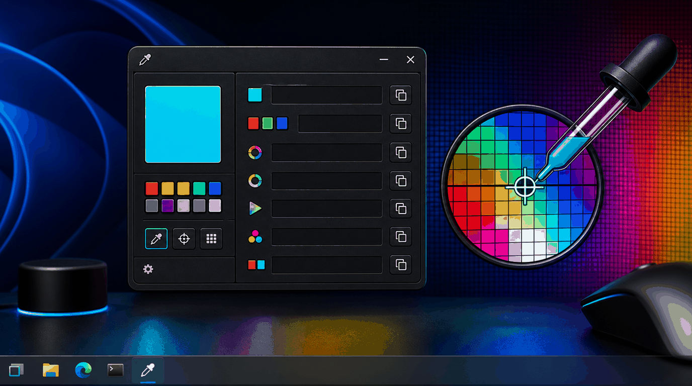
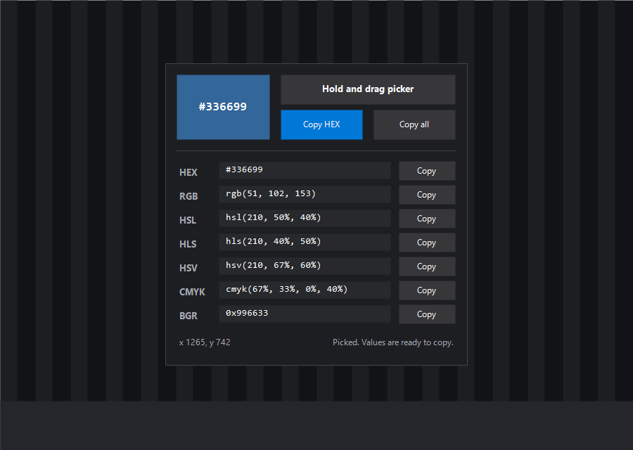

#  color-picker

Pixie-style screen color picker for Windows.

Hold the picker button, drag over the screen, and the window updates live with
the pixel under your cursor. Release the mouse to freeze the value, then copy
the format you need.

## Screenshot



## Usage

```powershell
color-picker
```

Or launch **Color Picker** from Windows Search after running the root
`install.ps1`.

## Formats

The picker shows:

| Format | Example |
|---|---|
| HEX | `#336699` |
| RGB | `rgb(51, 102, 153)` |
| HSL | `hsl(210, 50%, 40%)` |
| HLS | `hls(210, 40%, 50%)` |
| HSV | `hsv(210, 67%, 60%)` |
| CMYK | `cmyk(67%, 33%, 0%, 40%)` |
| BGR | `0x996633` |

## Tests

```powershell
powershell -NoProfile -ExecutionPolicy Bypass -File .\tools\color-picker\tests\test_color_picker_core.ps1
powershell -NoProfile -ExecutionPolicy Bypass -File .\tools\color-picker\color-picker.ps1 -SelfTest
powershell -NoProfile -ExecutionPolicy Bypass -File .\tools\color-picker\color-picker.ps1 -SmokeTest
wscript.exe .\tools\color-picker\color-picker.vbs -SelfTest
```

## Notes

- No external dependencies. It uses built-in .NET WinForms plus Win32/GDI pixel sampling.
- The VBS launcher starts it silently, so shortcuts do not flash a console window.
- The value freezes when you release the mouse, which makes copying less annoying than a permanent tracking mode.
