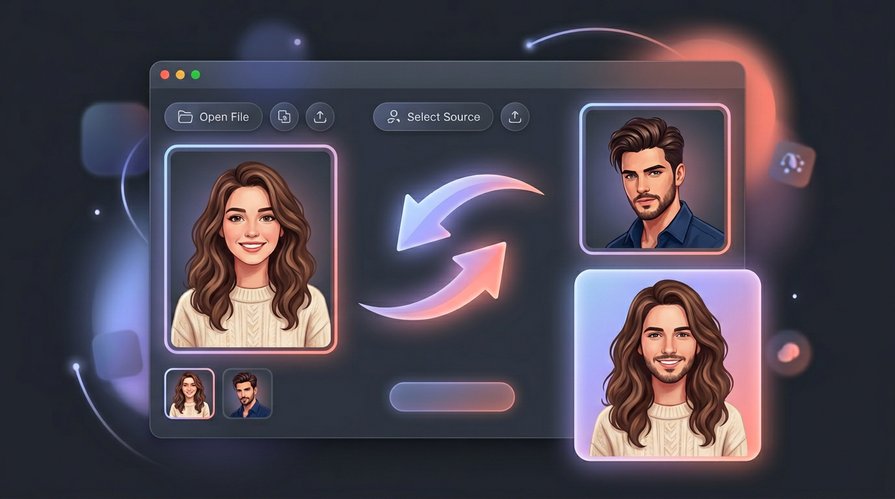
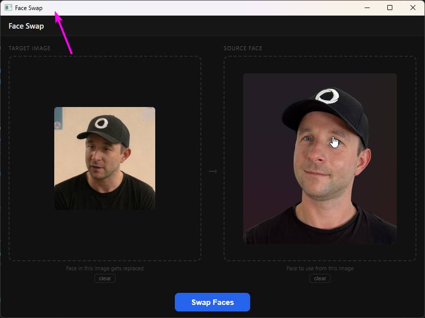

#  face-swap

Swap a face from one image into another locally using InsightFace. It opens a small desktop window where you drop a target image and a source face, watch the live logs while it runs, then get the final image auto-saved next to the original target.

## Screenshots

## Usage

**From File Explorer:**

- Right-click any image file, then choose **Mike's Tools > Face Swap** to pre-load that image as the target.
- Right-click a folder background, then choose **Mike's Tools > Face Swap** to open the tool empty.

**From Windows Search:**

- Press the Windows key, type `Face Swap`, and launch it directly.

The result is automatically saved beside the original target image with `_face-swapped` appended to the filename, for example `photo_face-swapped.jpg`.

## How It Works

- Left side: target image, the face in this image gets replaced
- Right side: source face, the face to copy from
- Step 1: choose the two images
- Step 2: live generation view with logs on screen
- Step 3: preview the final image and confirm where it was auto-saved

## Dependencies

- Python on `PATH`
- Python packages installed by `deps.ps1`: `insightface`, `onnxruntime` / `onnxruntime-gpu`, `opencv-python`
- `inswapper_128.onnx` model in `%LOCALAPPDATA%\face-swap\models\inswapper_128.onnx`

The model can be downloaded automatically from inside the app on first run.

## Notes

- This runs fully locally, no cloud face swap API involved.
- GPU is used if ONNX Runtime exposes CUDA, otherwise it falls back to CPU.
- The app shows live stdout/stderr logs while swapping so it is obvious what is happening under the hood.
