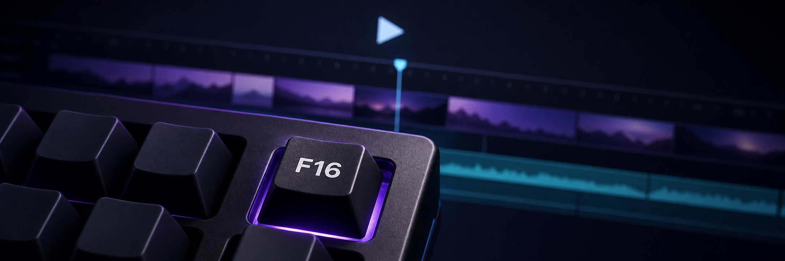

# Filmora Hotkey

Press `F16` to toggle Filmora playback while any other application remains
focused. Filmora must already be running with a project open.

The daemon uses macOS Accessibility to click Filmora's real
`View > Play / Pause` command. It does not send Space to the focused
application and it does not bring Filmora to the front.

## What it does

- Listens for `F16` globally
- Checks that `Wondershare Filmora Mac` is running
- Finds Filmora's `View > Play / Pause` accessibility menu item
- Presses that command without activating Filmora
- Ignores keyboard repeat events so one key press produces one toggle
- Starts automatically at login through a per-user LaunchAgent

## Setup

Map a spare Keychron key to `F16` in Keychron Launcher or VIA, then run:

```bash
bash tools/filmora-hotkey/setup_mac.sh
bash tools/filmora-hotkey/install-launchagent.sh
```

When macOS asks, allow the Python executable under
`System Settings > Privacy & Security > Accessibility`.

The daemon logs whether Accessibility and Input Monitoring are available at
startup. Filmora stays untouched when it is not running or its playback command
is unavailable.

## Commands

```bash
bash tools/filmora-hotkey/run-tests.sh
bash tools/filmora-hotkey/restart.sh
bash tools/filmora-hotkey/kill.sh
bash tools/filmora-hotkey/uninstall-launchagent.sh
```

Logs are written to `~/Library/Logs/filmora-hotkey.log`.

## Tests

The unit suite covers key-repeat suppression, Filmora menu discovery, successful
playback toggles, missing Filmora processes, and Accessibility failures:

```bash
bash tools/filmora-hotkey/run-tests.sh
```
