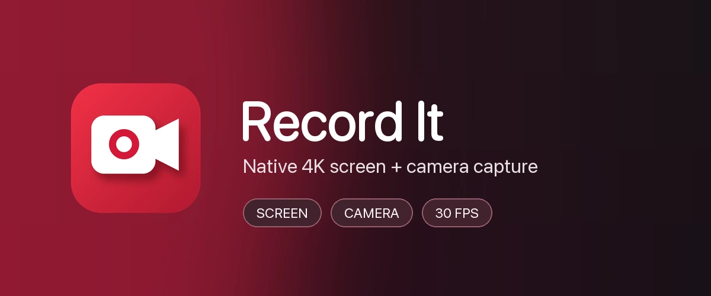
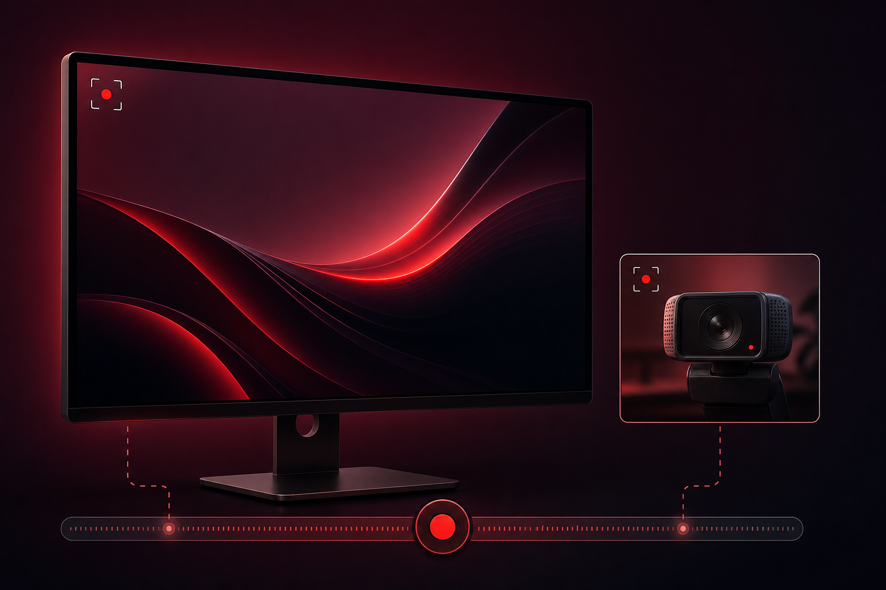

# record-it

A small native macOS screen and camera recorder built with SwiftUI,
ScreenCaptureKit, and AVFoundation.

## Preview



## What it records

- Screen, camera, or both
- The selected screen at 30 fps, encoded as HEVC
- `HG584T05` by default, with a 3840 × 2160 output
- The selected camera's best format at 30 fps, preferring native 3840 × 2160
- Selectable screen audio: **System Sound** or **None**. System Sound captures
  playback from music, browsers, videos, and other Mac apps, not a microphone
- Selectable camera microphone, defaulting to the first input with `Yeti` in its
  name. Choose **None** for a silent camera file
- Separate `screen.mov` and `camera.mov` files when recording both, preserving each source's full resolution

## File names

The file name field defaults to the existing timestamp format, without a file
extension:

```text
2026-07-15_115705
```

You can replace it before recording. Record It adds `-screen.mov` and/or
`-camera.mov` automatically, strips an accidentally entered `.mov` extension,
and resets the field to a fresh timestamp after every recording.

## Output folders

The Project menu lists directories under `~/Movies/Projects`, newest first.
Choosing a project saves into its `source` folder, creating it when needed:

```text
~/Movies/Projects/ai-tips/source/
```

Choosing **No Project** saves into:

```text
~/Movies/record-it-output/
```

Record It can reveal the completed files in Finder after stopping. That setting
is enabled by default and persists between launches.

## Setup

```bash
bash tools/record-it/setup_mac.sh
bash install_mac.sh
record-it
```

The first recording prompts for Screen Recording, Camera, and Microphone access.
If macOS asks you to restart the app after granting Screen Recording access, quit
and run `record-it` again.

## Development

```bash
swift test --package-path tools/record-it
bash tools/record-it/restart.sh
```

`restart.sh` stops the current app, builds a debug app bundle, signs it, stages it
at `~/Applications/Record It.app`, and launches it.
