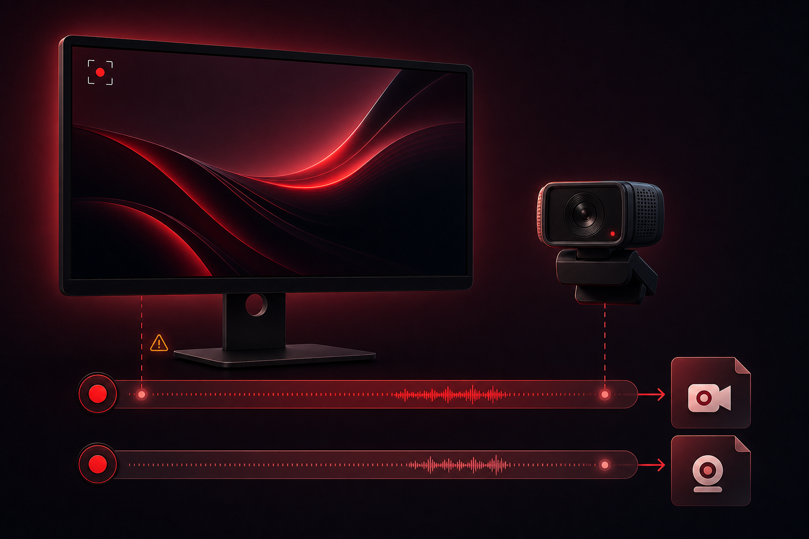

# record-it

A small native macOS screen, camera, and audio recorder built with SwiftUI,
ScreenCaptureKit, and AVFoundation.

## Screenshots




## What it records

- Screen, camera, both, or audio only
- The selected screen at 30 fps, encoded with the selected hardware H.264 or
  HEVC encoder
- `HG584T05` by default, preserving its active framebuffer resolution without
  upscaling. This machine keeps it at 1920 × 1080 HiDPI, producing a native
  3840 × 2160 recording
- The selected camera's best format at 30 fps, preferring native 3840 × 2160
- A **Preview…** button beside the camera selector opens a movable, resizable,
  uncropped live framing window without recording audio or creating a file.
  The preview window remembers its last position and size
- Selectable screen audio: **System Sound** or **None**. System Sound captures
  playback from music, browsers, videos, and other Mac apps, not a microphone
- Selectable camera microphone, defaulting to the first input with `Yeti` in its
  name. Choose **None** for a silent camera file
- Audio-only mode records the selected input as stereo 48 kHz, 192 kbps AAC in
  an `audio.m4a` file. It does not require a display, camera, or video encoder
- Separate `screen.mov` and `camera.mov` files when recording both, preserving each source's full resolution

## Encoder settings

Open **Encoder → Settings…** to choose from the H.264 and HEVC hardware
encoders currently available through VideoToolbox. The rate-control menu only
shows modes supported by the selected encoder:

- **CBR** uses a fixed bitrate target
- **CQP** pins the frame quantization level; lower values give higher quality
  and larger files
- **VBR** uses separate target and maximum bitrates

The selected encoder, rate-control mode, bitrates, and CQP level are saved
automatically and restored on the next launch.

The selected recording mode, **Screen**, **Camera**, **Both**, or **Audio**, is also saved
immediately and restored the next time Record It opens.

## Display resolution

Record It captures the selected display's active framebuffer exactly and never
changes display modes. Keep `HG584T05` at 1920 × 1080 HiDPI in macOS or
BetterDisplay to record a native 3840 × 2160 source. Use browser, editor, or
terminal zoom when individual application content needs to be larger.

## File names

The file name field defaults to the existing timestamp format, without a file
extension:

```text
2026-07-15_115705
```

You can replace it before recording. Record It adds `-screen.mov`,
`-camera.mov`, or `-audio.m4a` automatically, strips an accidentally entered
`.mov` or `.m4a` extension, and resets the field to a fresh timestamp after every
recording.

## Output folders

The Project menu lists directories under `~/dev/convex/convex-videos`, newest
first.
Choosing a project saves into its `source` folder, creating it when needed:

```text
~/dev/convex/convex-videos/ai-tips/source/
```

Choosing **No Project** saves into:

```text
~/Movies/record-it-output/
```

Record It can reveal the completed files in Finder after stopping. That setting
is enabled by default and persists between launches.

## Recording diagnostics

While recording, the setup form is replaced with a live dashboard for each
active source. It shows the actual video and audio samples accepted by the
writer, media timeline, current file size, output format, output file name, and
pipeline health. This is writer telemetry, not just a recording timer, so a
green state confirms that media is reaching the output file.

Screen recordings use variable-duration frames, so a static screen does not
create a huge duplicate-frame backlog in the 4K hardware encoder. Record It
also watches screen and camera callbacks plus sustained encoder backpressure.
The dashboard warns after three seconds without video activity. If video stalls
for ten seconds, or the encoder rejects 60 consecutive samples, the recording
stops with a visible error instead of continuing silently with audio only.

Session starts, frame-status changes, 30-second health checks, failures, and
stops are written to:

```text
~/Library/Logs/Record It/record-it.log
```

## Setup

```bash
bash tools/record-it/setup_mac.sh
bash install_mac.sh
record-it
```

The first use of each capture source prompts for Screen Recording, Camera, or
Microphone access.
If macOS asks you to restart the app after granting Screen Recording access, quit
and run `record-it` again.

## Development

```bash
swift test --package-path tools/record-it
bash tools/record-it/restart.sh
```

`restart.sh` stops the current app, builds a debug app bundle, signs it, stages it
at `~/Applications/Record It.app`, and launches it. When no Apple Development
certificate is installed, the build uses a stable local designated requirement
so macOS privacy permissions survive subsequent ad-hoc rebuilds.
