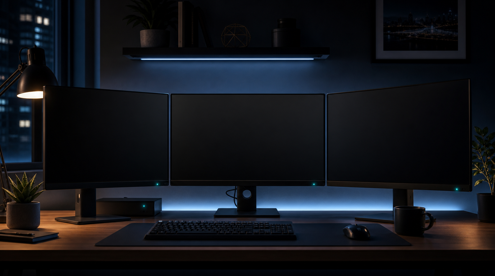

#  sleep-monitors

Turns off all connected monitors using Windows' normal monitor power message.
The PC keeps running, and the displays wake back up when you move the mouse or
press a key.

## Usage

```powershell
sleep-monitors
sleep-monitors -DelaySeconds 3
```

The Start Menu shortcut installed by `install.ps1` launches it silently, so it
works nicely from Windows Search. That shortcut waits 5 seconds before sleeping
the monitors so the keypress that launched it does not immediately wake them.

If the shortcut does nothing, check:

```powershell
Get-Content "$env:LOCALAPPDATA\sleep-monitors\sleep-monitors.log" -Tail 20
```

## Assets

`docs/header.png` is a generated raster banner for the public site.
`icons/sleep-monitors.png` is based on the repo's existing monitor icon.
