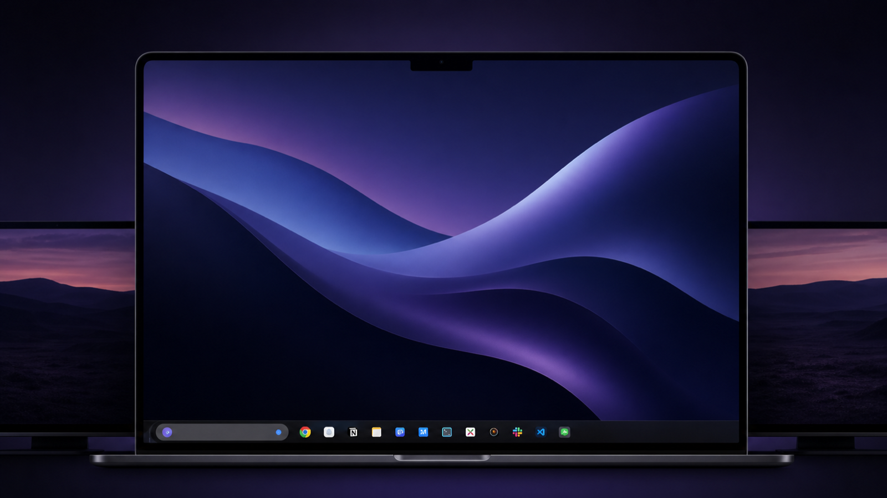
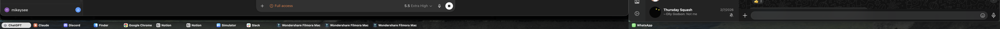
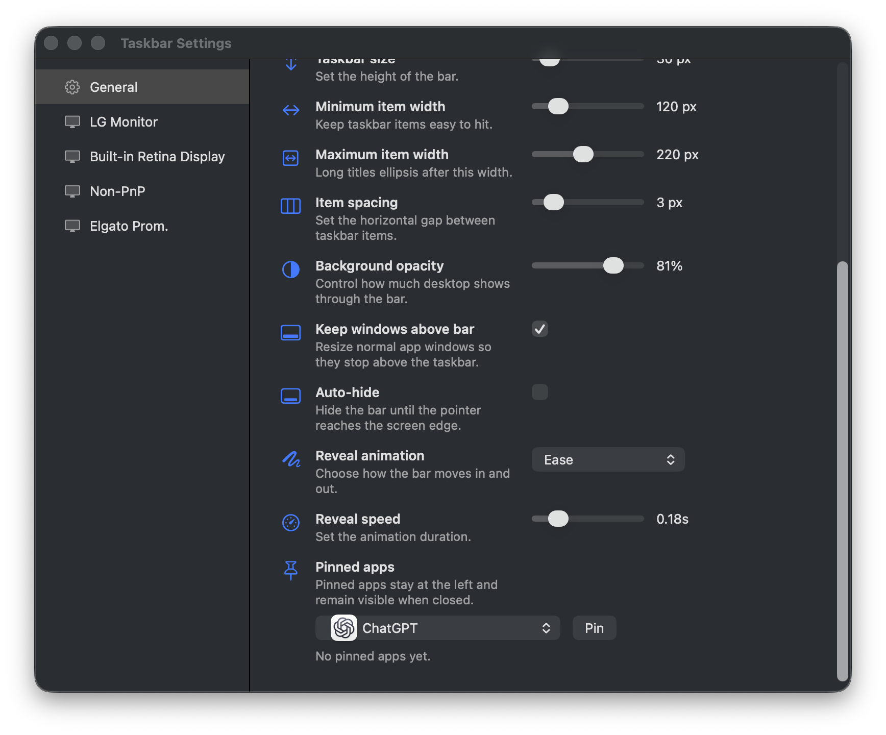

# taskbar

Windows-style taskbar for macOS, built in Swift/AppKit.

It draws a compact taskbar at the bottom of every monitor, shows each visible
window as its own item, lets you pin apps, and can keep normal app windows from
maximising underneath the bar.





## What it does

- Shows one taskbar per monitor
- Shows every window individually instead of grouping by app
- Keeps the selected app highlighted with a sliding pill
- Pins apps so they stay visible when closed
- Shrinks item widths when the bar is crowded so every item still fits
- Ellipsises long labels
- Shows or hides the clock
- Auto-hides with configurable animation
- Controls taskbar size, item width, item spacing, and background opacity
- Keeps normal windows above the taskbar when apps maximise
- Opens the settings window for the monitor you right-clicked
- Supports global defaults plus per-monitor overrides
- Can start automatically at login

## Quick start

```bash
bash tools/taskbar/setup_mac.sh
bash tools/taskbar/restart.sh
```

If you have run the root macOS installer, you can use the launcher:

```bash
taskbar restart
taskbar settings
taskbar stop
```

Otherwise open settings directly:

```bash
bash tools/taskbar/open-settings.sh
```

Stop it with:

```bash
bash tools/taskbar/kill.sh
```

## Settings

Right-click any taskbar and choose settings.

The General page sets the default values. Each monitor page can inherit those
defaults or override individual settings for that display.

Useful settings:

- Taskbar size
- Minimum and maximum item width
- Horizontal spacing between items
- Background opacity
- Clock mode
- Auto-hide and reveal animation
- Pinned apps
- Keep windows above bar
- Start at login

## Permissions

Keeping windows above the bar uses macOS Accessibility APIs. If that setting is
enabled, grant Accessibility access to:

```text
~/Applications/Mikerosoft Taskbar.app
```

Do not grant the raw SwiftPM binary in `.build`; `restart.sh` stages and signs a
real app bundle so macOS can remember the permission consistently.

Logs go to:

```text
~/Library/Logs/mikerosoft-taskbar.log
```

## Development

Run the Swift tests:

```bash
swift test --package-path tools/taskbar
```

Run the small Python model tests left from the original spike:

```bash
python3 -m unittest tools/taskbar/tests/test_taskbar_model.py
```

Restart the app after code changes:

```bash
bash tools/taskbar/restart.sh
```

## Notes

This started as a Python prototype, so the old Python files are still in this
folder for reference. The real app is now the Swift package under
`Sources/TaskbarApp`.
