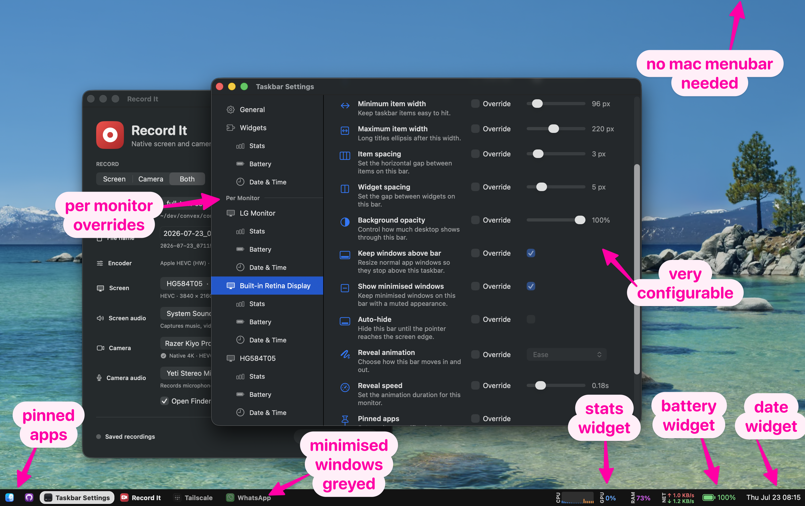

# taskbar

Windows-style taskbar for macOS, built in Swift/AppKit.

It draws a compact taskbar at the bottom of every monitor, shows each visible
window as its own item, lets you pin apps, and can keep normal app windows from
maximising underneath the bar.

## What it does

- Shows one taskbar per monitor
- Shows every window individually instead of grouping by app
- Minimises the active window when its item is clicked again, and restores it on the next click
- Keeps the selected app highlighted with a sliding pill
- Pins apps so they stay visible when closed
- Shrinks item widths when the bar is crowded so every item still fits
- Ellipsises long labels
- Supports Date & Time, Battery, and Stats taskbar widgets
- Lets widgets own their menu, rendering, and settings surface
- Auto-hides with configurable animation
- Hides on any monitor occupied by a foreground fullscreen app or game
- Controls taskbar size, item width, item spacing, and background opacity
- Keeps normal windows above the taskbar when apps maximise
- Opens the settings window for the monitor you right-clicked
- Supports global defaults plus per-monitor overrides
- Can start automatically at login

## Quick start

```bash
bash tools/taskbar/setup_mac.sh
bash tools/taskbar/restart.sh
```

If you have run the root macOS installer, you can use the launcher:

```bash
taskbar restart
taskbar settings
taskbar stop
```

Otherwise open settings directly:

```bash
bash tools/taskbar/open-settings.sh
```

Stop it with:

```bash
bash tools/taskbar/kill.sh
```

## Settings

Right-click any taskbar and choose settings.

The General page sets the default values. Each monitor page can inherit those
defaults or override individual bar settings for that display. Widget settings
live under the Widgets section instead of being mixed into the bar settings.

Useful settings:

- Taskbar size
- Minimum and maximum item width
- Horizontal spacing between items
- Independent horizontal spacing between widgets
- Background opacity
- Date & Time widget display
- Battery widget with the current charge level and charging state
- Stats widget CPU, RAM, network, and CPU display modes
- Auto-hide and reveal animation
- Pinned apps
- Keep windows above bar
- Start at login

Windows on other Spaces are intentionally not shown. Window discovery uses
CGWindowList's `.optionOnScreenOnly`, so each taskbar reflects the windows on
the currently visible Space.

## Widgets

Widgets are built as small AppKit plugins inside the taskbar app. A widget owns
its rendering, right-click menu, and settings controls, while still using the
same global-default plus per-monitor override model as the rest of the bar.

The settings sidebar lists installed widgets under Widgets, and also shows each
monitor's widget override pages under that monitor. Disabled widgets remain
visible in settings so they can be turned back on.

Date & Time uses menu-bar-style text and can show or hide the date, day of week,
seconds, and 24-hour time independently per monitor.

Battery reads the Mac's internal battery through the native IOKit power-source
API. Its wide battery outline fills continuously to the exact percentage and
keeps a charging bolt without replacing the level. It also uses a low-battery
warning colour. Its right-click menu includes the charging state and remaining
time when macOS reports one.

Stats shows CPU, RAM, and network activity in a compact strip. CPU can show a
percentage, aggregate usage history, or one live utilisation bar per logical
CPU. Per-CPU bars use the performance-level names reported by macOS and colour
Super, Performance, and Efficiency cores differently. Each tier colour can be
changed from the Stats widget settings, globally or per monitor. Its first slice
uses native macOS sampling APIs and takes design/API
inspiration from
[exelban/stats](https://github.com/exelban/stats), which is MIT licensed, but it
does not vendor the full Stats app.

## Permissions

Window titles need Screen Recording permission. Without it, `kCGWindowName`
is blank, which degrades taskbar titles and window matching. Grant Screen
Recording access to the app bundle below.

Keeping windows above the bar uses macOS Accessibility APIs. If that setting is
enabled, grant Accessibility access to the same app bundle:

```text
~/Applications/Mikerosoft Taskbar.app
```

Do not grant the raw SwiftPM binary in `.build`; `restart.sh` stages and signs a
real app bundle so macOS can remember the permission consistently.

Logs go to:

```text
~/Library/Logs/mikerosoft-taskbar.log
```

## Development

Run the Swift tests:

```bash
swift test --package-path tools/taskbar
```

Run the small Python model tests left from the original spike:

```bash
python3 -m unittest tools/taskbar/tests/test_taskbar_model.py
```

Restart the app after code changes:

```bash
bash tools/taskbar/restart.sh
```

## Notes

This started as a Python prototype, so the old Python files are still in this
folder for reference. The real app is now the Swift package under
`Sources/TaskbarApp`.
