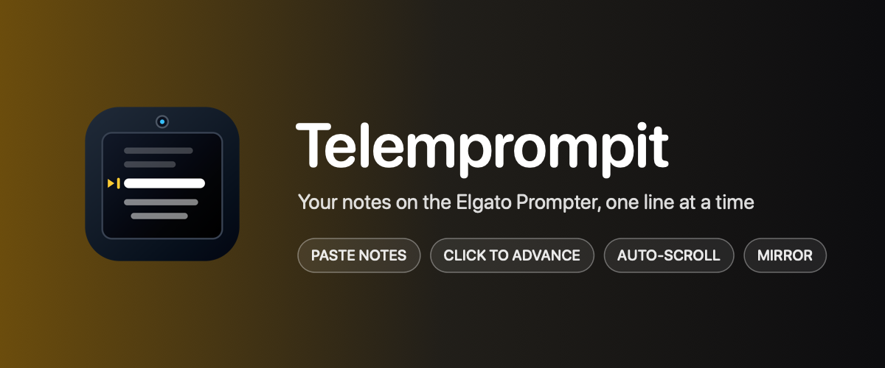
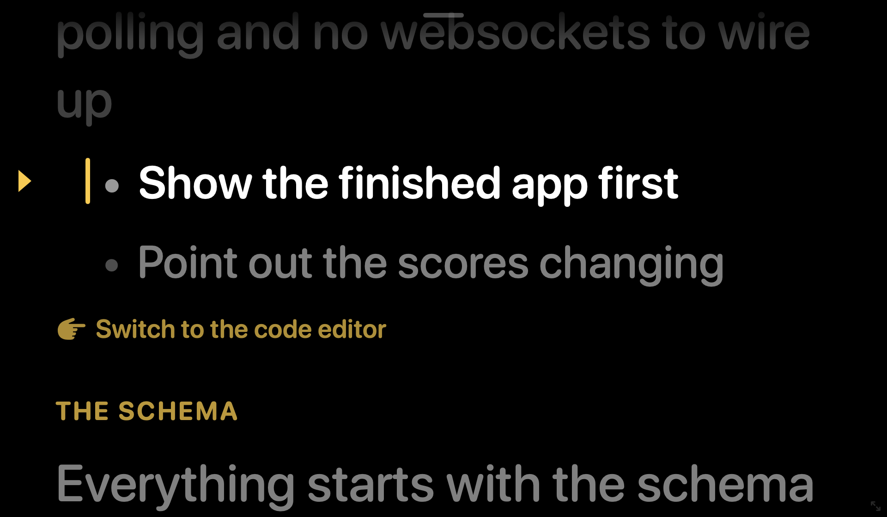

# telemprompit

A native macOS teleprompter for talking-head recordings. Paste your notes and
it opens them on the Elgato Prompter, one line at a time.

## What it does

- Opens on the Elgato Prompter (a DisplayLink display) and fills it, leaving
  room for the taskbar. When the prompter isn't connected it opens as a
  960 × 560 window on the main screen instead, and moves itself to the
  prompter as soon as the display is switched on
- Borderless window with a small drag handle at the top and a resize grip in
  the bottom-right corner. It remembers where you put it on each display
- Paste plain text, markdown, or Notion bullet lists with ⌘V. List markers,
  checkboxes, bold/italic/code/link markup, Notion `{toggle="true"}`
  attributes, and layout tags are stripped. Nested bullets stay indented with
  a dot so the structure is still readable
- The current line is highlighted on the reading line. Upcoming lines are
  dimmed, and lines already read are dimmer still
- Headings show as small section labels, Notion callouts as cues, and fenced
  code as a dimmed block. Only real lines are navigation stops, so clicks
  never land on a heading
- Optional smooth auto-scroll with adjustable speed. The highlight follows the
  reading line as it scrolls
- Mirror mode for beam-splitter glass
- Settings persist in `UserDefaults`

## Controls

| Input | Action |
|---|---|
| Click, Space, →, ↓, Return, Page Down | Next line |
| Right-click, ←, ↑, Page Up | Previous line |
| Home / End | First / last line |
| Scroll wheel or trackpad | Fine-tune the position |
| P | Start or pause auto-scroll |
| `[` / `]` | Slower / faster |
| `+` / `-` | Bigger / smaller text |
| M | Mirror horizontally |
| ⌘V | Replace the script with the clipboard |
| ⌘E | Edit the script |
| ⌘, | Settings |
| ⌘F | Fill the current display, or restore |

These work from any app while Telemprompit is running, so a presentation
clicker drives it while you demo something else:

| Global key | Action |
|---|---|
| Page Down / Page Up | Next / previous (what most clickers send) |
| ⌃⌥→ / ⌃⌥← | Next / previous |
| ⌃⌥Space | Start or pause auto-scroll |

Both groups can be switched off in **Settings > Controls**. Page Up and Page
Down are captured from every app while the global clicker option is on.

### URL commands

`telemprompit://next`, `previous`, `restart`, `end`, `play`, `pause`,
`toggle`, `faster`, `slower`, `paste`, and `settings`. A Stream Deck
"Website" or "Open" action can press these, and so can a script:

```bash
open -g telemprompit://next
```

## Settings

- **Script**: edit the pasted notes directly. Edits keep your place
- **Appearance**: font size, line spacing, gap between lines, side margins,
  left or centred text, text/background/highlight colours, how bright
  upcoming lines are, reading-line position, the reading-line marker, and
  mirroring
- **Controls**: auto-scroll speed, global keys, keep on top, follow the
  prompter, and **Turn On Elgato Prompter**

**Turn On Elgato Prompter** (also in the View menu) presses the prompter's
switch in DisplayLink Manager, the same way the taskbar lights button does.
It needs Accessibility permission the first time.

## Install

```bash
bash tools/telemprompit/setup_mac.sh
```

This builds a release app at `~/Applications/Telemprompit.app`. Launch it
from Spotlight, or put the launcher on your `PATH` with `bash install_mac.sh`
and run:

```bash
telemprompit                    # open
telemprompit start notes.md     # open with a file as the script
telemprompit restart            # debug rebuild + relaunch
telemprompit stop
```

## Development

```bash
swift test --package-path tools/telemprompit
bash tools/telemprompit/restart.sh
```

The prompter-display lookup and the DisplayLink switch live in the shared
[`tools/lib/PrompterKit`](../lib/PrompterKit) package, which Taskbar and
Video HQ also use.

| Path | What it is |
|---|---|
| `Sources/TelemprompitApp/ScriptParser.swift` | Pasted notes → prompter items |
| `Sources/TelemprompitApp/PromptNavigator.swift` | Stops, stepping, and auto-scroll position |
| `Sources/TelemprompitApp/PrompterModel.swift` | Script, position, scroll offset, and auto-scroll |
| `Sources/TelemprompitApp/PrompterView.swift` | SwiftUI rendering, drag handle, resize grip |
| `Sources/TelemprompitApp/PrompterWindowController.swift` | Borderless window, placement, keys, clicks |
| `Sources/TelemprompitApp/GlobalHotkeys.swift` | Carbon hotkeys (no Accessibility needed) |
| `Sources/TelemprompitApp/PrompterSettings.swift` | Persisted settings |
| `build-app.sh` | Builds, stages, and signs the app bundle |
