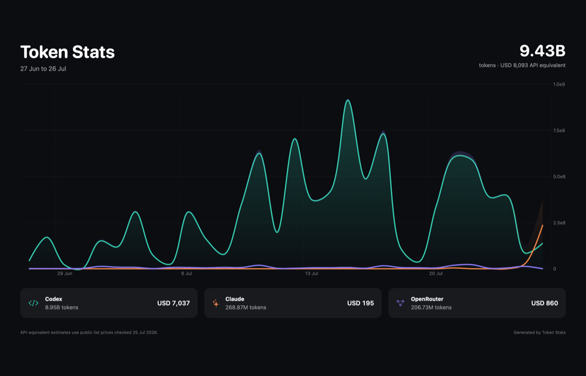

# token-stats

A native SwiftUI dashboard for local AI token usage. It reads Codex and Claude
Code session histories automatically, estimates their API-equivalent cost, and
pulls exact OpenRouter usage through its Activity API.

## What it shows

- Daily token usage for Codex, Claude, and OpenRouter
- 7, 30, 90 day, and all-time ranges
- Token and API-equivalent cost chart modes
- Total, cached input, active days, provider totals, and model breakdowns
- Exact OpenRouter cost from the Activity API or a historical CSV
- A 1400 x 900 PNG export designed for sharing

Codex is read from `~/.codex/sessions` and `~/.codex/archived_sessions`.
Claude is read from `~/.claude/projects`. Claude's streamed JSONL entries are
deduplicated by message ID so partial copies are not counted repeatedly.

## OpenRouter

Automatic activity requires an OpenRouter management key because normal
inference keys cannot access the account Activity API. Create a dedicated key
at [OpenRouter Management Keys](https://openrouter.ai/settings/management-keys),
then choose **Connect API** in Token Stats. The key is stored in macOS Keychain,
never in the repo or app preferences.

The API supplies the last 30 completed UTC days. To add older history, export
the detailed data from [openrouter.ai/activity](https://openrouter.ai/activity):

1. Choose the time period and grouping.
2. Open the options menu.
3. Choose **Export to → CSV**.
4. In Token Stats, open the OpenRouter menu and choose **Add history CSV**.

Token Stats remembers the file using a macOS security-scoped bookmark. API rows
take precedence on overlapping days, so importing a CSV never doubles usage.

## Cost estimates

Codex and Claude values are estimates at public API list prices, including
cached reads and cache writes when the source log exposes them. The bundled
rate card was checked on 25 July 2026. Unknown model names still count toward
token totals, but contribute `$0` until a price is added.

OpenRouter API and export costs use the exact billed `usage` value. BYOK
inference estimates are not added because that spend is paid outside
OpenRouter.

## Setup

```bash
bash tools/token-stats/setup_mac.sh
bash install_mac.sh
token-stats
```

The app is installed at `~/Applications/Token Stats.app`.

## Development

```bash
swift test --package-path tools/token-stats
bash tools/token-stats/restart.sh
```

`restart.sh` stops the running copy, builds and signs the debug app, stages it
in `~/Applications`, and launches it.
