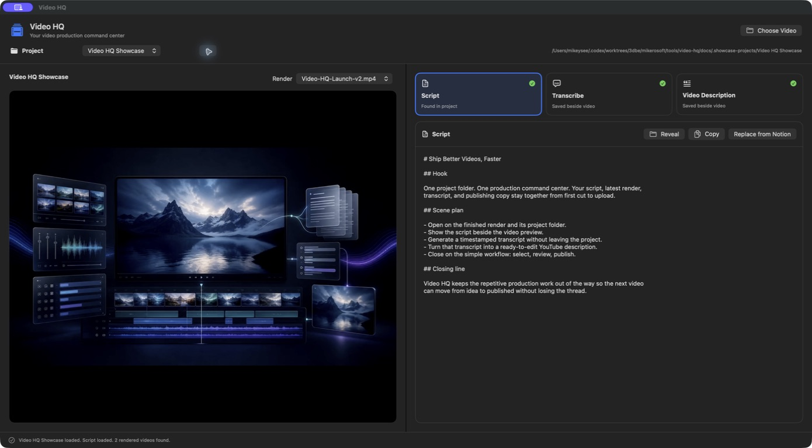
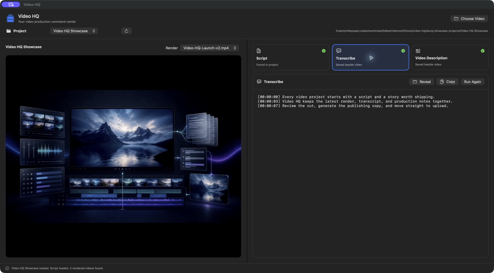
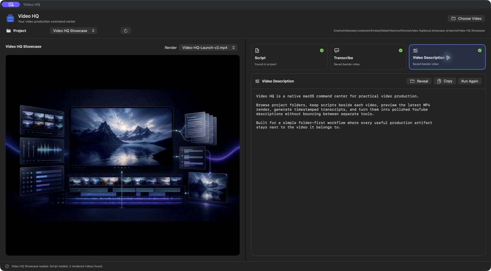

# Video HQ


A native macOS command center for Mike's video-production workflows. Video HQ
treats each direct folder in `~/dev/convex/convex-videos` as one video project,
loads its script, and previews rendered MP4s from the project root.
The last selected project is restored the next time the app opens.

If a project contains multiple root MP4 files, use the Render picker to switch
between them. Videos inside subfolders such as `source/` are deliberately
ignored by the automatic render picker. You can still choose or drag any video
manually.

## Tools

- **Transcribe** runs the repo's existing `tools/transcribe/transcribe` launcher
  and saves `<video-name>.srt` beside the video.
- **Video Description** loads that transcript and uses Gemini through OpenRouter
  to save `<video-name>-description.txt` beside the video. If the transcript is
  missing, the app generates it first.
- **Script** loads `script.md`, or another root Markdown/text file with `script`
  in its name. It can search shared Notion pages or accept a Notion page link,
  then download the page as Markdown to `<project>/script.md`. Video HQ records
  the source page ID in YAML front matter, so later downloads become one-click
  syncs from the same Notion page. A Raw/Preview control switches between the
  source text and rendered Markdown. The metadata stays hidden in the app and
  its Teleprompter, which opens large, centered script text on the Elgato
  Prompter display.
- **New Project** is available from the project dropdown. It can create a blank
  local project or start from a project in the Convex Projects Notion database
  whose status is `Writing` or `Ready to Shoot`. The wizard suggests an editable
  kebab-case folder name and downloads Notion content as `script.md`.
- **Rough Cut Review** opens a separate source-recording workspace. It can copy
  a recording into the current project's `source` directory, reuse a saved
  word-timestamp transcript or SRT, run the Filmora automation repository's
  silence and repeated-take planner, and display valid sections, false starts,
  bad takes, and review items on a playable timeline. Purple markers flag
  retained speech that poorly matches the script, while likely omitted script
  paragraphs appear beside the timeline for review. Dragging across the
  analysis timeline continuously scrubs the video and scrolls to highlight the
  matching detected section. Every detected section has
  persistent **Auto**, **Keep**, and **Cut** controls. Filmora export writes a
  separate reviewed plan and a new `.wfp`. Video HQ automatically finds a clean
  single-source Filmora project for the selected recording, so export only asks
  for the new project name and location. It never overwrites the planner output,
  source project, or an existing project.

Existing sidecars are loaded whenever a video is opened. Description files are
compatible with the existing `video-description` CLI chat-log format, and the
app displays its latest Gemini response.

## Screenshots

### Script and render workspace



### Timestamped transcript



### YouTube description



## Setup

```bash
bash tools/transcribe/deps.sh
bash tools/video-hq/setup_mac.sh
```

The setup script builds, signs, installs, and opens:

```text
~/Applications/Video HQ.app
```

You can then launch **Video HQ** from Spotlight, Raycast, Alfred, Finder, or
another macOS app launcher.

## Requirements

- macOS 13 or newer
- Swift from Xcode or Command Line Tools
- `ffmpeg` and `faster-whisper` for transcription
- `/Users/m5-mike/dev/me/automate-filmora` for Rough Cut Review's planner
- `OPENROUTER_API_KEY` in the repo-root `.env` for video descriptions
- `NOTION_API_KEY` in the repo-root `.env` for Notion search and script download

The Notion integration needs read-content access, and each script page must be
shared with the integration before it will appear in search or download by URL.
Set `VIDEO_HQ_PROJECTS_ROOT` before running `setup_mac.sh` if projects live
somewhere other than `~/dev/convex/convex-videos`.

Rough Cut Review defaults to
`~/.local/share/mikerosoft-media-venv/bin/python` for independent-region Whisper
transcription. Override the planner checkout or Python environment before setup
with `VIDEO_HQ_FILMORA_AUTOMATION_ROOT` and `VIDEO_HQ_ROUGH_CUT_PYTHON`. Each
run is preserved under the project's `work/video-hq-rough-cut` directory with
its transcript, plan, review report, manual decision sidecar, and versioned
reviewed plans. Filmora export currently creates a new rough-cut project from a
clean source project that Video HQ discovers recursively inside the current
project folder. A recording still needs one Filmora-created clean project before
its first export. Merging into an existing edited project or inserting another
timeline is deliberately not supported until that Filmora operation has its own
controlled before-and-after format experiment.

## Development

```bash
swift test --package-path tools/video-hq
bash tools/video-hq/setup_mac.sh
```

The app calls the transcribe launcher by its repo path and adds common Homebrew
locations to the child-process `PATH`, so it works when launched outside a
terminal.
