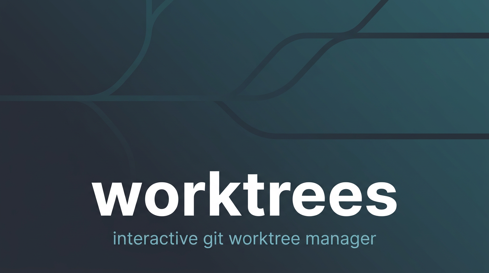

#  worktrees

Interactive helper for cleaning up **git worktrees**. I use it when Cursor leaves a pile of linked checkouts under `.cursor/worktrees` and I want to list them, delete a few, or nuke all linked ones without touching the primary checkout.


## What it does

| Step | Detail |
|---|---|
| Detect repo | Uses `git rev-parse --show-toplevel` from your **current directory**, so you must be inside some checkout of that repo (any subfolder is fine). |
| List | Prints every worktree from `git worktree list --porcelain`, labelled **primary** vs **linked** (linked means the git dir lives under `.git/worktrees/`). |
| Remove | Only **linked** worktrees are selectable. I never try to remove the primary checkout through this UI. |
| Confirm | You get a final yes or no before anything is deleted. |

Removals run `git worktree remove`. If a tree has local changes or locked files, git may refuse unless you pass **`--force`** (same as `git worktree remove --force`).


## Dependencies

- [Bun](https://bun.sh) on your `PATH`
- `git`
- In this repo: run **`bun install`** inside `tools/worktrees` once per clone (or let Windows `install.ps1` run `deps.ps1`, which does that for you).


## macOS

1. `cd tools/worktrees && bun install`
2. Put the launcher on your `PATH` (I use **`~/.local/bin`**, same idea as dropping stubs into a folder that is already on `PATH` on Windows):

   ```bash
   bash tools/worktrees/install-to-path.sh
   ```

   That copies the small `worktrees` script into `~/.local/bin`. If `worktrees` is not found, add this to `~/.zshrc` and open a new terminal:

   ```bash
   export PATH="$HOME/.local/bin:$PATH"
   ```

3. From **any directory inside a checkout** of this repo:

   ```bash
   worktrees
   ```

The launcher always runs **`tools/worktrees/index.ts` from the repo root that git reports for your cwd**, so each clone needs its own `bun install` in that path if `node_modules` is missing.

You can still run **`bash tools/worktrees/run.sh`** from the repo root if you prefer not to use `~/.local/bin`.


## Windows

1. Run **`install.ps1`** at the repo root (re-run when you add or change tools). That writes **`worktrees.bat`** into `C:\dev\tools` (or whatever your tools dir is) and runs **`tools/worktrees/deps.ps1`** when Bun is installed.
2. Open a new terminal and run **`worktrees`** from any folder inside a checkout.


## Usage

```bash
worktrees          # normal remove (git may refuse if dirty)
worktrees --force  # same as -f, passes --force to git worktree remove
```

There is no non-interactive batch mode. If you need that later, we can add flags.


## Tests

From `tools/worktrees`:

```bash
bun test
```


## Icon

`icons/worktrees.png` is **`application_view_list.png`** from the [FamFamFam Silk](https://www.famfamfam.com/lab/icons/silk/) set (Mark James, [CC BY 2.5](https://creativecommons.org/licenses/by/2.5/)).
